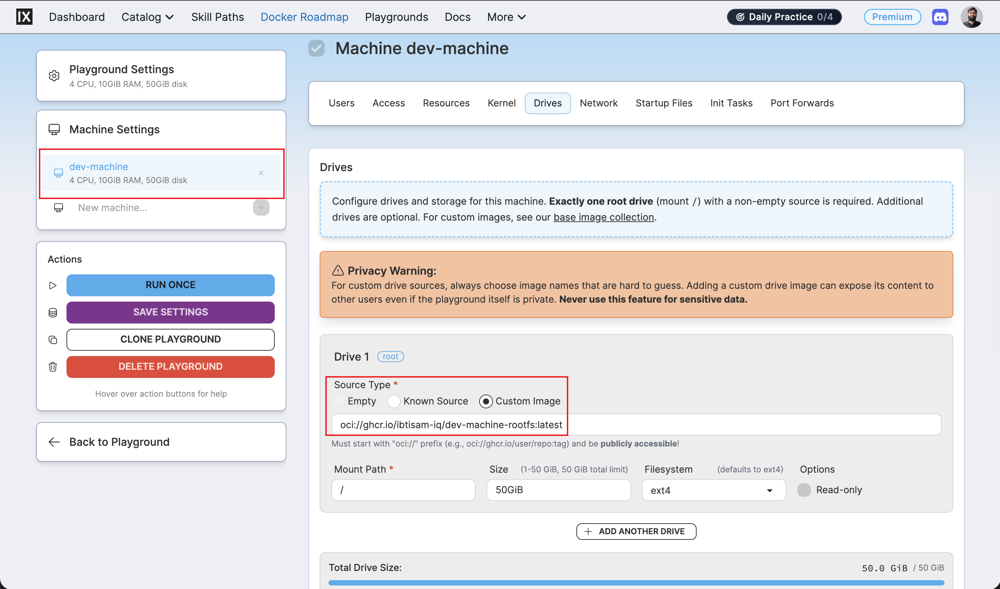

# Dev Machine Rootfs: DevOps Workstation Image Build and Integration

## Context

Dev Machine Rootfs is a production‑grade DevOps workstation image for iximiuz playgrounds built on top of `ubuntu-24-04-rootfs`.

It turns the generic Ubuntu base into a fully provisioned environment with Docker, Kubernetes tooling, Terraform, AWS CLI, Ansible, security scanners, and an aggressive alias/completion setup aimed at day‑to‑day platform work.


The image is built from the Dev Machine Dockerfile and helper scripts:

- Dockerfile: [`iximiuz/rootfs/dev/machine/Dockerfile`](https://github.com/ibtisam-iq/silver-stack/blob/main/iximiuz/rootfs/dev/machine/Dockerfile)
- Scripts: [`iximiuz/rootfs/dev/machine/scripts/`](https://github.com/ibtisam-iq/silver-stack/blob/main/iximiuz/rootfs/dev/machine/scripts/)
- Welcome banner: [`iximiuz/rootfs/dev/machine/welcome`](https://github.com/ibtisam-iq/silver-stack/blob/main/iximiuz/rootfs/dev/machine/welcome)

A dedicated GitHub Actions workflow builds and pushes the image to GHCR, and the iximiuz manifest mounts it as the root drive for the `SilverStack Dev Machine` playground:

- Workflow: [`.github/workflows/build-dev-machine-rootfs.yml`](https://github.com/ibtisam-iq/silver-stack/blob/main/.github/workflows/build-dev-machine-rootfs.yml)
- Manifest: [`iximiuz/manifests/dev-machine.yml`](https://github.com/ibtisam-iq/silver-stack/blob/main/iximiuz/manifests/dev-machine.yml)

For the full feature table and narrative, see the Dev Machine README:
[`iximiuz/rootfs/dev/machine/README.md`](https://github.com/ibtisam-iq/silver-stack/blob/main/iximiuz/rootfs/dev/machine/README.md)

---

## Objectives

Dev Machine Rootfs must:

- Provide a **single interactive DevOps workstation** image that boots instantly on iximiuz.
- Inherit a stable, systemd‑enabled Ubuntu 24.04 environment from `ubuntu-24-04-rootfs`.
- Pre‑install the **full SilverStack toolchain** (Docker, Kubernetes CLIs, IaC tools, security scanners, and supporting utilities) matching the versions advertised in the Dev Machine README.
- Configure **aliases and bash completions** so `k`, `d`, and other shortcuts behave like their full commands.
- Ship a Dev Machine‑specific **welcome banner** that clearly documents tools, shortcuts, and ephemerality.
- Be built reproducibly via **GitHub Actions**, tagged and pushed to GHCR, and wired to the iximiuz manifest as an `oci://` rootfs image.

---

## Architecture / Conceptual Overview

Dev Machine Rootfs is intentionally **workstation‑only**: it does not introduce systemd services of its own and does not serve an app.

It exists purely as an interactive DevOps environment that boots on top of the Ubuntu base image [`ubuntu-24-04-rootfs`](https://github.com/ibtisam-iq/silver-stack/blob/main/iximiuz/rootfs/ubuntu/README.md).

The design relies on the base image to provide stable OS behavior and focuses this layer on:

- Toolchain installation (Docker, runtimes, Kubernetes CLIs, IaC tools, scanners).
- Shell ergonomics: aliases, completions, and a tuned `.bashrc`.
- A consistent onboarding story via `~/.welcome`.

All heavy lifting is split into focused scripts under
[`iximiuz/rootfs/dev/machine/scripts/`](https://github.com/ibtisam-iq/silver-stack/blob/main/iximiuz/rootfs/dev/machine/scripts/):

- `install-docker.sh` - installs Docker CE and configures the current user.
- `install-tools.sh` - orchestrates multi‑phase installation of runtimes, Kubernetes tooling, IaC binaries, scanners, and utilities.
- `install-cloudflared.sh` - adds Cloudflare Tunnel CLI.
- `setup-completions.sh` - wires bash completions and alias‑based completions into `/etc/bash_completion.d`.
- `customize-bashrc.sh` - appends aliases and helper functions into the user’s shell config, matching the alias map in the welcome banner.

In CI, the Dev Machine workflow
[`.github/workflows/build-dev-machine-rootfs.yml`](https://github.com/ibtisam-iq/silver-stack/blob/main/.github/workflows/build-dev-machine-rootfs.yml)
uses Docker Buildx to produce multi‑arch images, injects OCI metadata via `docker/metadata-action`, and sets `USER=ibtisam` as the build arg so the image matches the documented default in the README.

---

## Key Decisions

- **Keep services out of Dev Machine**
  Systemd services remain the responsibility of the base rootfs and specific service images; Dev Machine stays as a pure interactive workstation so terminal and IDE tabs remain the focus.

- **Script‑heavy provisioning**
  Centralizing Docker, tools, cloudflared, completions, and bashrc customization into scripts keeps the Dockerfile readable and allows iterative refinement of the workstation layer without touching the base image.

- **Aggressive alias and completion setup**
  The Dev Machine welcome banner and README emphasize aliases and completions because they materially change how fast common kubectl, docker, terraform, and git operations are performed in day‑to‑day work.

- **CI as source of truth**
  The GitHub Actions workflow is configured for multi‑arch, tagged builds with explicit base‑image metadata and a fixed `USER`; treating CI as canonical keeps local and playground behavior aligned over time.

---

## Source Layout and Inputs

Primary source artifacts:

- README: [`iximiuz/rootfs/dev/machine/README.md`](https://github.com/ibtisam-iq/silver-stack/blob/main/iximiuz/rootfs/dev/machine/README.md)
- Dockerfile: [`iximiuz/rootfs/dev/machine/Dockerfile`](https://github.com/ibtisam-iq/silver-stack/blob/main/iximiuz/rootfs/dev/machine/Dockerfile)
- Welcome banner: [`iximiuz/rootfs/dev/machine/welcome`](https://github.com/ibtisam-iq/silver-stack/blob/main/iximiuz/rootfs/dev/machine/welcome)
- Scripts directory: [`iximiuz/rootfs/dev/machine/scripts/`](https://github.com/ibtisam-iq/silver-stack/blob/main/iximiuz/rootfs/dev/machine/scripts/)
- iximiuz manifest: [`iximiuz/manifests/dev-machine.yml`](https://github.com/ibtisam-iq/silver-stack/blob/main/iximiuz/manifests/dev-machine.yml)
- GitHub Actions workflow: [`.github/workflows/build-dev-machine-rootfs.yml`](https://github.com/ibtisam-iq/silver-stack/blob/main/.github/workflows/build-dev-machine-rootfs.yml)

On disk:

```text
iximiuz/rootfs/dev/machine/
├── Dockerfile
├── README.md
├── welcome
└── scripts/
    ├── customize-bashrc.sh
    ├── install-cloudflared.sh
    ├── install-docker.sh
    ├── install-tools.sh
    └── setup-completions.sh
```

---

## Prerequisites

Before building Dev Machine Rootfs:

- The Ubuntu base rootfs image `ghcr.io/ibtisam-iq/ubuntu-24-04-rootfs:latest` must be built and published, as referenced in the Dev Machine Dockerfile `FROM` line.
- A local checkout of `github.com/ibtisam-iq/silver-stack` is available, with the tree under
  [`iximiuz/rootfs/dev/machine`](https://github.com/ibtisam-iq/silver-stack/tree/main/iximiuz/rootfs/dev/machine).
- Docker Buildx is available locally, or a GitHub Actions runner is configured with `docker/setup-qemu-action` and `docker/setup-buildx-action` as in the workflow.
- You have permission to push packages to GHCR using `secrets.GITHUB_TOKEN` (CI) or a PAT (local push).

---

## Installation / Build Steps

### 1. Build Dev Machine Rootfs locally

From `iximiuz/rootfs/dev/machine`:

```bash
IMAGE_NAME="ghcr.io/ibtisam-iq/dev-machine-rootfs:latest"

docker build \
  --build-arg USER="ibtisam" \
  -t "${IMAGE_NAME}" \
  .
```

> **Why only USER here:** The Dev Machine Dockerfile exposes `USER`, `BUILD_DATE`, and `VCS_REF`, but CI is responsible for wiring `BUILD_DATE` and `VCS_REF` via the metadata action; local builds only need the interactive username.

During this build the Dockerfile in
[`iximiuz/rootfs/dev/machine/Dockerfile`](https://github.com/ibtisam-iq/silver-stack/blob/main/iximiuz/rootfs/dev/machine/Dockerfile)
performs, conceptually:

- `FROM ghcr.io/ibtisam-iq/ubuntu-24-04-rootfs:latest`, inheriting OS and user layout from the base image.
- Sets `USER root` so installation scripts run with full privileges.
- Copies and runs `install-docker.sh` with `USER=${USER}` to set up Docker CE and configure user access.
- Copies `install-tools.sh` into `/tmp/scripts` and executes it to install the complete DevOps toolchain in a multi‑phase sequence matching the README table.
- Copies and runs `install-cloudflared.sh` to install Cloudflare Tunnel CLI.
- Runs `setup-completions.sh` to register bash completions and alias‑aware completions.
- Executes `chown -R ${USER}:${USER} /home/${USER}` to fix ownership after root‑phase writes under the user’s home directory.
- Switches to `USER $USER`, sets `HOME=/home/$USER`, copies the Dev Machine `welcome` banner into `$HOME/.welcome`, and runs `customize-bashrc.sh` to append aliases and helpers.
- `EXPOSE 22` to document the SSH port for local Docker testing.

---

### 2. Validate the toolchain and aliases locally

Run the container:

```bash
docker run -it --rm \
  --name dev-machine-test \
  -p 7022:22 \
  ghcr.io/ibtisam-iq/dev-machine-rootfs:latest \
  /bin/bash
```

Inside, verify runtimes and core tools:

```bash
java -version
python3 --version
node --version
npm --version
mvn -version

docker --version
kubectl version --client
helm version --short
kustomize version
k9s version
kubectx --help | head -n 3
kubens --help | head -n 3
stern --version

terraform version
aws --version
ansible --version
ansible-lint --version
pre-commit --version
yamllint --version

skopeo --version
dive --version
hadolint --version
trivy --version
gitleaks --version
cosign version
syft version

jq --version
yq --version
fzf --version
rg --version
nmap --version
socat -V | head -n 1
cloudflared --version
```

> **Why this matters:** The Dev Machine README lists these binaries and versions, and the welcome banner markets them; confirming they are present avoids surprises when using this machine as a reference workstation.

Check aliases and completions:

```bash
alias | grep -E '^alias (k|d|tf|g|ll|la|ports|myip)='
```

Tab completion check (interactive):

```bash
# Type and then press TAB in the shell:
# k get <TAB>
# d run <TAB>
```

> **Why this matters:** The README states that `k` and `d` share completion behavior with `kubectl` and `docker`; confirming this validates `setup-completions.sh` and shell integration.

Display the Dev Machine welcome banner:

```bash
cat ~/.welcome
```

> **Why this matters:** The banner communicates the supported tools and shortcuts, plus the ephemeral nature of the VM; validating it guarantees a consistent onboarding experience in every new playground.

---

### 3. Build and push via GitHub Actions

Dev Machine’s CI builds are driven by
[`.github/workflows/build-dev-machine-rootfs.yml`](https://github.com/ibtisam-iq/silver-stack/blob/main/.github/workflows/build-dev-machine-rootfs.yml).

On `push` to `main` or on PRs touching `iximiuz/rootfs/dev/machine/**` (excluding its README) or the workflow file itself, the workflow:

- Checks out the repo and sets up QEMU and Buildx for multi‑architecture builds (amd64, arm64).
- Logs into GHCR using `secrets.GITHUB_TOKEN` with `packages: write` permission.
- Uses `docker/metadata-action` to generate labels and tags, including
  `org.opencontainers.image.base.name=ghcr.io/ibtisam-iq/ubuntu-24-04-rootfs:latest`, a fixed `latest` tag on the default branch, `sha-*` tags, and a date tag.
- Runs `docker/build-push-action` with context `./iximiuz/rootfs/dev/machine`, `file` set to the Dev Machine Dockerfile, `platforms=linux/amd64,linux/arm64`, and `build-args` containing `USER=ibtisam`.
- Pushes the built images and prints the resulting digest.

> **Why this matters:** The CI workflow is the canonical way Dev Machine images are produced for iximiuz; matching local tags and args to the CI configuration keeps environments consistent.

---

## Verification

### GHCR image check

After CI or a manual push, verify that the registry holds the expected tags:

```bash
skopeo inspect docker://ghcr.io/ibtisam-iq/dev-machine-rootfs:latest | jq '.Name,.Labels."org.opencontainers.image.title"'
```

Expected:

```text
"ghcr.io/ibtisam-iq/dev-machine-rootfs"
"Dev Machine Rootfs"
```

This confirms that the image is present and that the OCI `title` label set in the Dockerfile is visible.

### iximiuz Dev Machine playground

The integration checks in the previous section double as final verification:

- Manifest references the correct `oci://` source and tag.
- `labctl playground create` succeeds without error.
- Login shows the correct user, welcome banner, and toolchain behavior.

---

## Integration with iximiuz Labs

Once the image is verified locally and pushed to GHCR, it can be launched as a custom iximiuz playground using the `labctl` CLI and a manifest file. Unlike iximiuz's built-in catalog labs, custom rootfs images cannot be started directly from the iximiuz UI - they require a manifest file to declare the machine drive source, resources, and tabs.

### Prerequisites

Before proceeding, ensure the following are in place on the machine from which you will run `labctl` commands:

1. **`labctl` is installed**
   ```bash
   # macOS
   brew install iximiuz/tools/labctl

   # Linux
   curl -sfL https://raw.githubusercontent.com/iximiuz/labctl/main/install.sh | sh
   ```
2. **`labctl` is authenticated**
   ```bash
   labctl auth login
   # Follow the one-time browser URL to complete authentication
   ```
   Verify the session:
   ```bash
   labctl auth whoami
   ```

---

### Step 1 - Create the playground

Download the manifest directly without cloning the full repository:

```bash
curl -fsSL https://raw.githubusercontent.com/ibtisam-iq/silver-stack/main/iximiuz/manifests/dev-machine.yml \
  -o dev-machine.yml
```

The manifest declares a single machine `dev-machine` whose root drive is mounted directly from the published GHCR image:

```yaml
drives:
  - source: oci://ghcr.io/ibtisam-iq/sonarqube-rootfs:latest
    mount: /
    size: 50GiB
```

The manifest can be edited before running - for example, to adjust `cpuCount`, `ramSize`, or `size` to match account quota or preferences.

Run `labctl playground create` pointing at the local manifest:

```bash
labctl playground create --base flexbox dev-machine -f dev-machine.yml
```

When the command succeeds, `labctl` prints the playground URL and its unique ID:

```
Creating playground from /path/to/<MANIFEST_FILENAME>
Playground URL: https://labs.iximiuz.com/playgrounds/dev-machine-<unique-id>
dev-machine-<unique-id>
```

> **Note:** The playground does **not** appear under **Playgrounds → Running**.
> Custom playgrounds created via `labctl` appear under **Playgrounds → My Custom**.

---

### Step 2 - Open the playground

Click the URL printed by `labctl`, or navigate manually:

1. Open [labs.iximiuz.com/dashboard](https://labs.iximiuz.com/dashboard).
2. In the dashboard navigation bar, click **Playgrounds**.
3. Under Playgrounds, click the **My Custom** tab.
4. Locate the playground by the `title` set in the manifest file
   (e.g., `SilverStack Dev Machine`). If the manifest title was
   customized before running, look for that name instead.
5. The playground card shows a **Start** button and a three-dot menu (⋮).

To start immediately, click **Start**.

To review or adjust settings before starting, click ⋮ → **Configure**. This opens the Playground Settings page where machine drives, resources, network, and UI tabs can be inspected before launch.



### Step 3 - Verify the running playground

Once started, the welcome banner is displayed automatically.


---

## Related

- Dev Machine Rootfs README - [`iximiuz/rootfs/dev/machine/README.md`](https://github.com/ibtisam-iq/silver-stack/blob/main/iximiuz/rootfs/dev/machine/README.md)
- Dev Machine Dockerfile - [`iximiuz/rootfs/dev/machine/Dockerfile`](https://github.com/ibtisam-iq/silver-stack/blob/main/iximiuz/rootfs/dev/machine/Dockerfile)
- Dev Machine scripts - [`iximiuz/rootfs/dev/machine/scripts/`](https://github.com/ibtisam-iq/silver-stack/blob/main/iximiuz/rootfs/dev/machine/scripts/)
- Dev Machine welcome banner - [`iximiuz/rootfs/dev/machine/welcome`](https://github.com/ibtisam-iq/silver-stack/blob/main/iximiuz/rootfs/dev/machine/welcome)
- Ubuntu base rootfs docs - [`iximiuz/rootfs/ubuntu/README.md`](https://github.com/ibtisam-iq/silver-stack/blob/main/iximiuz/rootfs/ubuntu/README.md)
- Dev Machine workflow - [`.github/workflows/build-dev-machine-rootfs.yml`](https://github.com/ibtisam-iq/silver-stack/blob/main/.github/workflows/build-dev-machine-rootfs.yml)
- Dev Machine manifest - [`iximiuz/manifests/dev-machine.yml`](https://github.com/ibtisam-iq/silver-stack/blob/main/iximiuz/manifests/dev-machine.yml)
