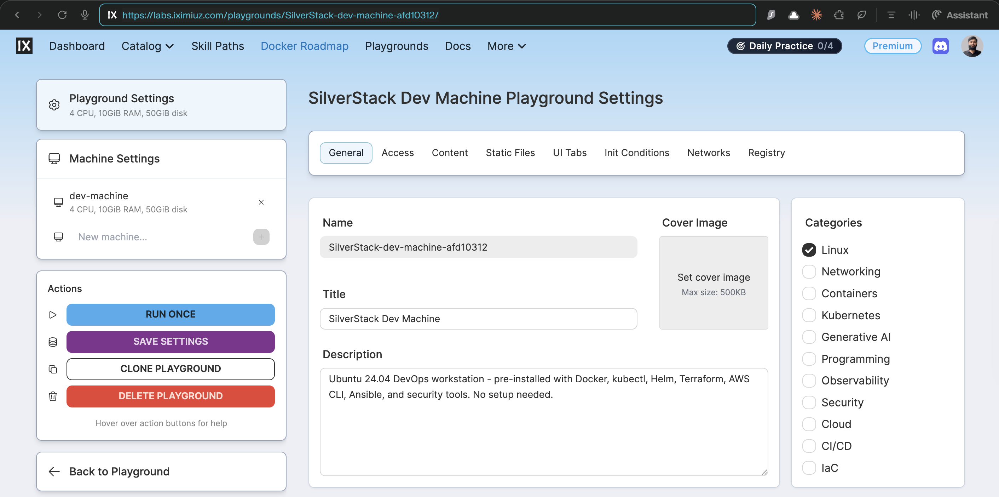
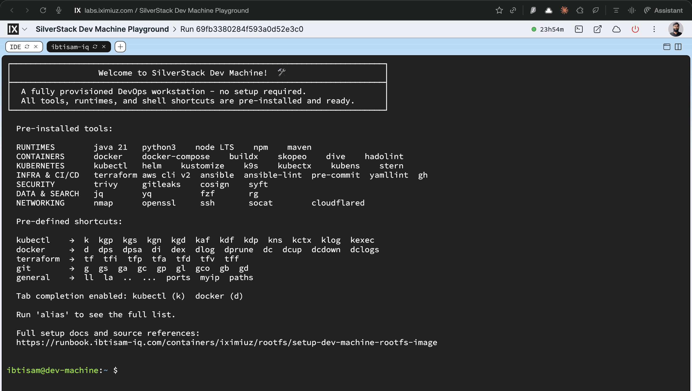

# Dev Machine Rootfs: DevOps Workstation Image Build and Integration

## Context

Dev Machine Rootfs is a production-grade DevOps workstation image for iximiuz playgrounds, built on top of `ubuntu-24-04-rootfs`.

It turns the generic Ubuntu base into a fully provisioned environment with Docker, Kubernetes tooling, Terraform, AWS CLI, Ansible, security scanners, and an aggressive alias/completion setup aimed at day-to-day platform work.

> **This image is a microVM rootfs for the [iximiuz Labs](https://labs.iximiuz.com) platform.** The platform mounts it as a block device and boots it with its own kernel. systemd becomes PID 1 through the platform boot process, not through Docker. Running the image with `docker run` will not produce a working systemd, Docker daemon, or network services - see [Verification](#verification) for the correct approach.



All source artifacts live under:

| Artifact | Path |
|---|---|
| Dockerfile | [`iximiuz/rootfs/dev/machine/Dockerfile`](https://github.com/ibtisam-iq/silver-stack/blob/main/iximiuz/rootfs/dev/machine/Dockerfile) |
| Scripts | [`iximiuz/rootfs/dev/machine/scripts/`](https://github.com/ibtisam-iq/silver-stack/tree/main/iximiuz/rootfs/dev/machine/scripts/) |
| Welcome banner | [`iximiuz/rootfs/dev/machine/welcome`](https://github.com/ibtisam-iq/silver-stack/blob/main/iximiuz/rootfs/dev/machine/welcome) |
| CI Workflow | [`.github/workflows/build-dev-machine-rootfs.yml`](https://github.com/ibtisam-iq/silver-stack/blob/main/.github/workflows/build-dev-machine-rootfs.yml) |
| iximiuz Manifest | [`iximiuz/manifests/dev-machine.yml`](https://github.com/ibtisam-iq/silver-stack/blob/main/iximiuz/manifests/dev-machine.yml) |

---

## Objectives

Dev Machine Rootfs must:

- Provide a **single interactive DevOps workstation** image that boots instantly on iximiuz.
- Inherit a stable, systemd-enabled Ubuntu 24.04 environment from `ubuntu-24-04-rootfs`.
- Pre-install the **full SilverStack toolchain** - Docker, Kubernetes CLIs, IaC tools, security scanners, and utilities - matching the versions in the Dev Machine README.
- Configure **aliases and bash completions** so `k`, `d`, and other shortcuts behave identically to their full commands.
- Ship a Dev Machine-specific **welcome banner** documenting all tools, shortcuts, and ephemerality.
- Be built reproducibly via **GitHub Actions**, tagged and pushed to GHCR as `ghcr.io/ibtisam-iq/dev-machine-rootfs`.

---

## Architecture / Conceptual Overview

Dev Machine Rootfs is intentionally **workstation-only**: it does not introduce systemd services of its own. It is a pure interactive DevOps environment layered on top of [`ubuntu-24-04-rootfs`](https://github.com/ibtisam-iq/silver-stack/blob/main/iximiuz/rootfs/ubuntu/README.md).

All installation work is split into focused scripts:

| Script | Purpose |
|---|---|
| `install-docker.sh` | Installs Docker CE from the official Docker apt repo; enables `docker.service`; adds `$USER` to docker group |
| `install-tools.sh` | 27-phase installation: runtimes, Kubernetes CLIs, IaC tools, security scanners, utilities |
| `install-cloudflared.sh` | Installs Cloudflare Tunnel CLI from the official Cloudflare apt repo |
| `setup-completions.sh` | Writes bash + zsh completions for all CLIs into `/etc/bash_completion.d/` (system-wide) |
| `customize-bashrc.sh` | Appends kubectl, docker, terraform, git, and utility aliases to `~/.bashrc` |

---

## Key Decisions

- **No systemd services** - systemd services belong to the base and service images; Dev Machine is a pure interactive workstation.

- **amd64-only build** - QEMU and arm64 are intentionally omitted. The CI workflow builds `linux/amd64` exclusively. This is a known limitation: Dev Machine cannot run on arm64 iximiuz hosts.

- **`install-tools.sh` uses `COPY`, not bind mount** - `install-tools.sh` runs `rm -rf /tmp/*` in its PHASE 27 final cleanup. A bind mount would cause `rm` to target a live mount point, producing undefined behavior. `COPY` places the script in a real image layer that can be safely deleted. All other scripts use bind mounts because they do not delete `/tmp/`.

- **`welcome` file placement** - `COPY welcome $HOME/.welcome` runs after all other install steps. `customize-bashrc.sh` appends logic to `~/.bashrc` that displays and deletes `~/.welcome` on first interactive login. The file must exist after all RUN layers complete - but it must not be consumed by a non-interactive build step. Placing it last guarantees it survives the build.

- **`BUILD_DATE` and `VCS_REF` injected by CI** - the workflow passes these as build-args from `docker/metadata-action` output and `github.sha`, respectively. Local builds may omit them; the OCI labels will be empty strings, which is acceptable for local testing only.

---

## Source Layout

```text
dev/machine/
├── Dockerfile
├── README.md
├── welcome
└── scripts/
    ├── customize-bashrc.sh
    ├── install-cloudflared.sh          # Uses COPY - deletes /tmp/*
    ├── install-docker.sh               # Uses bind mount (does not delete /tmp/)
    ├── install-tools.sh                # Uses COPY - deletes /tmp/* in PHASE 27
    ├── install-tools-all.sh            # Reference/dev script - NOT called in build
    └── setup-completions.sh            # Uses bind mount (does not delete /tmp/)
```

---

## Build Arguments

| ARG | CI Default | Description |
|---|---|---|
| `USER` | `ibtisam` | Non-root interactive user (inherited from base) |
| `BUILD_DATE` | From `docker/metadata-action` | OCI label: image creation timestamp |
| `VCS_REF` | `github.sha` | OCI label: git commit SHA |

---

## Prerequisites

- `ghcr.io/ibtisam-iq/ubuntu-24-04-rootfs:latest` is built and published (the `FROM` reference).
- Local checkout of [`github.com/ibtisam-iq/silver-stack`](https://github.com/ibtisam-iq/silver-stack) with `iximiuz/rootfs/dev/machine` available.
- Docker Buildx available locally, or a GitHub Actions runner with `docker/setup-buildx-action`.
- For CI: `packages: write` permission to push to GHCR via `secrets.GITHUB_TOKEN`.

---

## Build Steps

### 1. Local Build

From the `iximiuz/rootfs/dev/machine/` directory:

```bash
IMAGE_NAME="ghcr.io/ibtisam-iq/dev-machine-rootfs:latest"

docker build \
  --build-arg USER="ibtisam" \
  -t "${IMAGE_NAME}" \
  .
```

> `BUILD_DATE` and `VCS_REF` are injected by CI. Local builds do not require them.

The Dockerfile performs the following sequence:

**Step 1 - Inherit the base**

- `FROM ghcr.io/ibtisam-iq/ubuntu-24-04-rootfs:latest` - inherits systemd, SSH, `$USER` account, shell config, and base toolset.
- `USER root` is set for all installation steps.

**Step 2 - Install Docker CE** (`install-docker.sh` via bind mount)

- Adds the official Docker apt repository.
- Installs `docker-ce`, `docker-ce-cli`, `containerd.io`, `docker-buildx-plugin`, `docker-compose-plugin`.
- Writes `/etc/docker/daemon.json` (registry mirror for faster pulls).
- Runs `systemctl enable docker` - daemon starts automatically on VM boot, not during build.
- Adds `$USER` to the `docker` group.
- Installs bash completion for `docker` into `/etc/bash_completion.d/docker`.

**Step 3 - Install DevOps toolchain** (`install-tools.sh` via `COPY`)

- PHASE 1: Base packages (tmux, nano, nmap, socat, maven, git-lfs, openssl, etc.)
- PHASE 2: Java 21 (`openjdk-21-jdk`)
- PHASE 3: Python 3 + pip3 + venv + dev headers
- PHASE 4: Node.js LTS (NodeSource repo)
- NOTE: Docker CE was already installed by Step 2 (PHASE 5 is skipped)
- PHASE 6: kubectl v1.32 (official Kubernetes apt repo)
- PHASE 7: Helm (official install script)
- PHASE 8: Terraform (HashiCorp apt repo)
- PHASE 9: GitHub CLI (`gh`)
- PHASE 10: AWS CLI v2 (official installer)
- PHASE 11: Skopeo
- PHASE 12: k9s v0.50.10
- PHASE 13: kubectx + kubens v0.9.5
- PHASE 14: kustomize v5.7.1
- PHASE 15: stern v1.33.0
- PHASE 16: jq v1.8.1
- PHASE 17: yq v4.46.1
- PHASE 18: fzf v0.65.2
- PHASE 19: ripgrep v14.1.1
- PHASE 20: dive v0.13.1
- PHASE 21: hadolint v2.12.0
- PHASE 22: trivy v0.64.1
- PHASE 23: gitleaks v8.28.0
- PHASE 24: cosign v3.0.3
- PHASE 25: syft v1.26.1
- PHASE 26: pip tools (pre-commit, ansible, ansible-lint, yamllint)
- PHASE 27: Final cleanup - `rm -rf /var/lib/apt/lists/* /tmp/* /var/tmp/*`

**Step 4 - Install cloudflared** (`install-cloudflared.sh` via `COPY`)

- Adds the Cloudflare apt repository.
- Installs `cloudflared`.

**Step 5 - Set up completions** (`setup-completions.sh` via bind mount)

- Writes bash and zsh completions for all CLIs into `/etc/bash_completion.d/` and `/usr/share/zsh/vendor-completions/`.
- Tools covered: kubectl, helm, terraform, docker, gh, aws, kustomize, stern, kubectx/kubens, yq, trivy, cosign, syft, ansible, pre-commit, pip3, npm.

**Step 6 - Fix ownership**

- `chown -R ${USER}:${USER} /home/${USER}` - corrects ownership of any files root wrote into the user's home during steps 2–5.

**Step 7 - User customizations (order matters)**

- `USER $USER` and `ENV HOME=/home/$USER`
- `COPY welcome $HOME/.welcome` - placed at this stage so the banner is not consumed by any non-interactive build step.
- `customize-bashrc.sh` (bind mount) - appends kubectl, docker, terraform, git, and utility aliases and helpers to `~/.bashrc`.
- **`EXPOSE 22`** - documents the SSH port for iximiuz port-forwarding. SSH itself is managed by systemd inherited from the base image.

---

### 2. Build and Push via GitHub Actions

The canonical build runs via [`.github/workflows/build-dev-machine-rootfs.yml`](https://github.com/ibtisam-iq/silver-stack/blob/main/.github/workflows/build-dev-machine-rootfs.yml).

**Triggers:**

- `push` to `main` when files under `iximiuz/rootfs/dev/machine/**` (excluding `README.md`) or the workflow file change.
- Pull requests touching the same paths.
- Manual `workflow_dispatch`.

**Key steps:**

1. Checkout repository.
2. Set up Docker Buildx (no QEMU - amd64 only, intentional).
3. Log in to GHCR via `secrets.GITHUB_TOKEN`.
4. Extract metadata via `docker/metadata-action` - generates tags (`latest`, `sha-*`, `YYYY-MM-DD`) and OCI labels including `org.opencontainers.image.base.name`.
5. `docker/build-push-action` with:
    - `context: ./iximiuz/rootfs/dev/machine`
    - `platforms: linux/amd64`
    - `push: true` (non-PR only)
    - `build-args: USER=ibtisam`, `BUILD_DATE` (from metadata-action), `VCS_REF` (`github.sha`)
    - GHA layer cache enabled.
6. Print final image digest.

---

## Verification

### ✅ Correct: Inspect the Registry Image

After a CI push or manual `docker push`:

```bash
skopeo inspect docker://ghcr.io/ibtisam-iq/dev-machine-rootfs:latest \
  | jq '{
      name:          .Name,
      base:          .Labels["org.opencontainers.image.base.name"],
      created:       .Labels["org.opencontainers.image.created"],
      documentation: .Labels["org.opencontainers.image.documentation"],
      authors:       .Labels["org.opencontainers.image.authors"]
    }'
```

---

### ✅ Correct: Binary Presence Check (`docker run` - limited scope)

`docker run` with `/bin/bash` confirms that binaries are present on PATH. It does **not** validate runtime behavior (no systemd, no docker daemon, no SSH, no network services):

```bash
docker run --rm \
  ghcr.io/ibtisam-iq/dev-machine-rootfs:latest \
  bash -c "
    java -version 2>&1 | head -1
    python3 --version && pip3 --version
    node --version && npm --version
    mvn -version 2>&1 | head -1
    docker --version
    kubectl version --client --short 2>/dev/null || kubectl version --client
    helm version --short
    kustomize version
    k9s version
    stern --version
    terraform version | head -1
    aws --version
    ansible --version | head -1
    pre-commit --version
    trivy --version | head -1
    gitleaks version
    cosign version
    syft --version
    jq --version
    yq --version
    fzf --version
    rg --version
    cloudflared --version
  "
```

> This confirms binaries are installed and accessible. It does **not** confirm that `docker.service`, `ssh.service`, or any other systemd service is working. Errors like `Cannot connect to the Docker daemon` are expected and correct here.

---

### ✅ Correct: Full Runtime Verification (iximiuz microVM)

The only valid way to verify runtime behavior is to boot the image in an iximiuz microVM:

```bash
# Step 1 - ensure labctl is installed and authenticated
labctl auth whoami

# Step 2 - download the manifest
curl -fsSL https://raw.githubusercontent.com/ibtisam-iq/silver-stack/main/iximiuz/manifests/dev-machine.yml \
  -o dev-machine.yml

# Step 3 - create the playground
labctl playground create --base flexbox dev-machine -f dev-machine.yml
```

Once the VM is running, connect via the terminal provided by iximiuz or `labctl ssh`, then:

```bash
# System health
systemctl is-system-running          # Expected: running
systemctl status docker              # Expected: active (running)
systemctl status ssh                 # Expected: active (running)

# Shell config
echo $PS1                            # Expected: colored prompt
alias | grep "^alias k="             # Expected: alias k='kubectl'
alias | grep "^alias d="             # Expected: alias d='docker'

# Tool presence (quick check)
k version --client
d ps                                 # Expected: empty list, no daemon errors
tf version

# Welcome banner
cat ~/.welcome                       # Expected: Dev Machine banner (deleted after display)
```

---

### ❌ Not Valid: `docker run` for systemd or service checks

Running with `docker run` (even `--privileged`) will not produce a working systemd environment because the image has no `CMD` to start systemd. This is correct behavior - it confirms the image is purpose-built for microVM use.

Expected errors when attempting service checks via `docker run`:

```
System has not been booted with systemd as init system (PID 1). Can't operate.
Cannot connect to the Docker daemon at unix:///var/run/docker.sock
```

These are **not bugs** - they are expected and correct.

---

## Integration with iximiuz Labs

### Prerequisites

1. **Install `labctl`**

    ```bash
    # macOS
    brew install iximiuz/tools/labctl

    # Linux
    curl -sfL https://raw.githubusercontent.com/iximiuz/labctl/main/install.sh | sh
    ```

2. **Authenticate**

    ```bash
    labctl auth login
    labctl auth whoami
    ```

### Step 1 - Download the Manifest

```bash
curl -fsSL https://raw.githubusercontent.com/ibtisam-iq/silver-stack/main/iximiuz/manifests/dev-machine.yml \
  -o dev-machine.yml
```

The manifest's drive source must reference the Dev Machine image:

```yaml
drives:
  - source: oci://ghcr.io/ibtisam-iq/dev-machine-rootfs:latest
    mount: /
    size: 50GiB
```

### Step 2 - Create the Playground

```bash
labctl playground create --base flexbox dev-machine -f dev-machine.yml
```

> The playground appears under **Playgrounds → My Custom**, not under **Playgrounds → Running**.

### Step 3 - Open and Verify

Navigate to the URL printed by `labctl`, or open the playground from [labs.iximiuz.com/dashboard](https://labs.iximiuz.com/dashboard).

Once connected, run the runtime verification steps listed in [Verification](#verification) above.



---

## Related

- [Dev Machine README](https://github.com/ibtisam-iq/silver-stack/blob/main/iximiuz/rootfs/dev/machine/README.md)
- [Dev Machine Dockerfile](https://github.com/ibtisam-iq/silver-stack/blob/main/iximiuz/rootfs/dev/machine/Dockerfile)
- [Dev Machine scripts](https://github.com/ibtisam-iq/silver-stack/tree/main/iximiuz/rootfs/dev/machine/scripts)
- [Ubuntu base rootfs README](https://github.com/ibtisam-iq/silver-stack/blob/main/iximiuz/rootfs/ubuntu/README.md)
- [Dev Machine workflow](https://github.com/ibtisam-iq/silver-stack/blob/main/.github/workflows/build-dev-machine-rootfs.yml)
- [Dev Machine manifest](https://github.com/ibtisam-iq/silver-stack/blob/main/iximiuz/manifests/dev-machine.yml)
