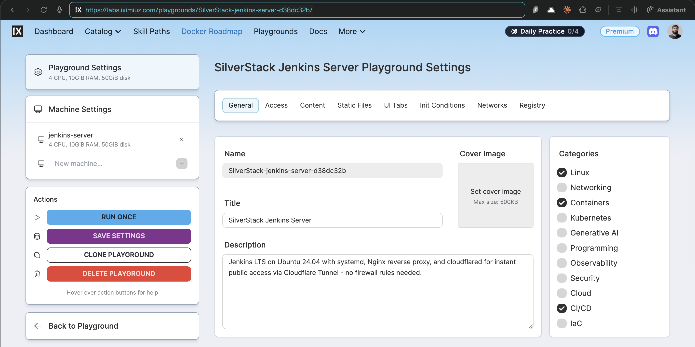
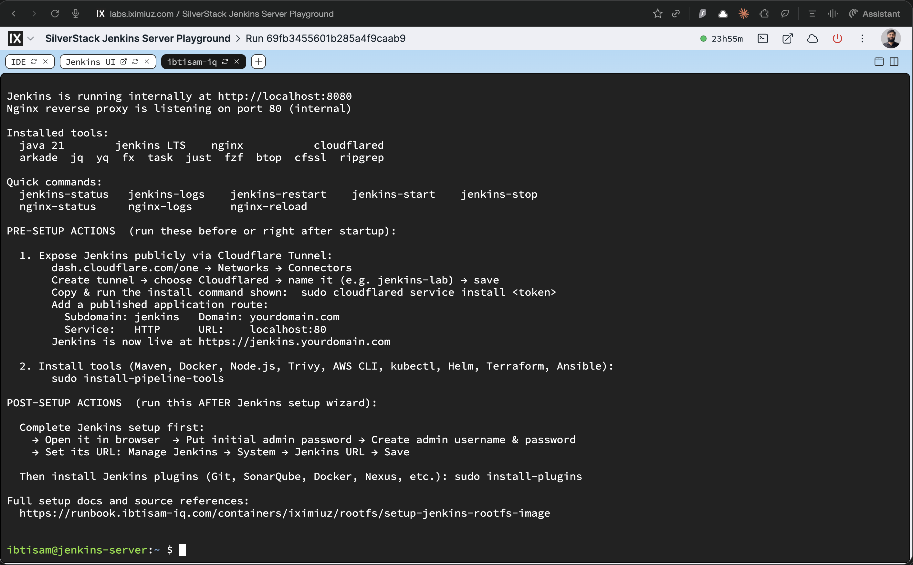

# Jenkins LTS Rootfs: CI Server Image Build and Integration

## Context

Jenkins LTS Rootfs is a production-grade Jenkins CI server image for iximiuz playgrounds. It boots Jenkins via systemd, with Nginx as a reverse proxy and `cloudflared` pre-installed for instant public access over a Cloudflare Tunnel.



> **This image is a microVM rootfs for the [iximiuz Labs](https://labs.iximiuz.com) platform.** The platform mounts it as a block device and boots it with its own kernel. systemd becomes PID 1 through the platform boot process. Do not attempt to validate systemd, Docker daemon, or service behavior via `docker run` - use `labctl` instead (see [Verification](#verification)).

**Pipeline tools and plugins are intentionally NOT baked in.** Two post-setup scripts are placed on `PATH` and run by you after the VM is live - keeping the image lean and your toolchain choices explicit.

All source artifacts:

| Artifact | Path |
|---|---|
| Dockerfile | [`iximiuz/rootfs/jenkins/Dockerfile`](https://github.com/ibtisam-iq/silver-stack/blob/main/iximiuz/rootfs/jenkins/Dockerfile) |
| Scripts | [`iximiuz/rootfs/jenkins/scripts/`](https://github.com/ibtisam-iq/silver-stack/tree/main/iximiuz/rootfs/jenkins/scripts/) |
| Configs | [`iximiuz/rootfs/jenkins/configs/`](https://github.com/ibtisam-iq/silver-stack/tree/main/iximiuz/rootfs/jenkins/configs/) |
| Welcome banner | [`iximiuz/rootfs/jenkins/welcome`](https://github.com/ibtisam-iq/silver-stack/blob/main/iximiuz/rootfs/jenkins/welcome) |
| CI Workflow | [`.github/workflows/build-jenkins-rootfs.yml`](https://github.com/ibtisam-iq/silver-stack/blob/main/.github/workflows/build-jenkins-rootfs.yml) |
| iximiuz Manifest | [`iximiuz/manifests/jenkins-server.yml`](https://github.com/ibtisam-iq/silver-stack/blob/main/iximiuz/manifests/jenkins-server.yml) |

---

## Objectives

Jenkins LTS Rootfs must:

- Provide a Jenkins LTS instance running on top of `ubuntu-24-04-rootfs` with systemd as PID 1.
- Start services in boot order: `lab-init` → `nginx` → `jenkins`, making Jenkins available on **port 80** via Nginx immediately on first boot.
- Configure Nginx as a reverse proxy using a build-time parameterized port (`__JENKINS_PORT__`), with `/health` endpoint and production-grade headers.
- Provide a Cloudflare-ready environment via `cloudflared` so Jenkins can be exposed on a custom domain with SSL - no firewall rules needed.
- Expose two post-setup scripts (`install-pipeline-tools`, `install-plugins`) on `/usr/local/bin/` and **never run them during the build**.
- Apply a **limited `sudo` profile** for the `jenkins` daemon user - enough to manage services and read logs, but not full root.
- Be built reproducibly via GitHub Actions and published as `ghcr.io/ibtisam-iq/jenkins-rootfs` with `latest`, `lts`, and `2.541.2-lts` tags.

---

## Architecture / Conceptual Overview

The image inherits the full OS base from `ubuntu-24-04-rootfs` (systemd, SSH, non-root user `ibtisam`, prompt, shell config) and adds a Jenkins runtime stack on top:

| Layer | Components |
|---|---|
| Inherited from base | systemd, SSH, user `ibtisam`, bash config, base tools |
| Runtime stack | Java 21 (OpenJDK), Jenkins LTS (`jenkins` user), Nginx reverse proxy, `cloudflared` |
| Systemd units | `lab-init.service`, `nginx.service` (override), `jenkins.service` |
| Security | Limited `sudoers` for `jenkins` daemon, no full root |
| Post-setup (user-run) | `install-pipeline-tools`, `install-plugins` |

### Boot Sequence

```
systemd (PID 1)
  └── lab-init.service  [oneshot]
        Generates SSH host keys (ephemeral per VM)
        Creates /run/sshd, /run/nginx
        Fixes /var/lib/jenkins ownership
          ↓ (After=)
  └── nginx.service     [simple, daemon off]
        Listens on :80
        Reverse proxies → 127.0.0.1:JENKINS_PORT
          ↓ (After=)
  └── jenkins.service   [notify]
        /usr/bin/jenkins --httpPort=JENKINS_PORT
        Runs as jenkins:jenkins
        OOMScoreAdjust=-900 (protected from OOM killer)
```

### Port Substitution

`__JENKINS_PORT__` is a build-time placeholder substituted via `sed` during the Docker build in three files:

| File | What changes |
|---|---|
| `/etc/nginx/sites-available/jenkins` | `upstream jenkins { server 127.0.0.1:__JENKINS_PORT__ }` |
| `/etc/systemd/system/jenkins.service` | `ExecStart=/usr/bin/jenkins --httpPort=__JENKINS_PORT__` |
| `$HOME/.welcome` | Displayed URL in the welcome banner |

CI default: `JENKINS_PORT=8080`. Override with `--build-arg JENKINS_PORT=<port>`.

---

## Key Decisions

**Post-setup tools and plugins, not baked in** - `install-pipeline-tools` and `install-plugins` are placed on `PATH` as callable scripts, not run during build. This keeps image size minimal and gives full control over what gets installed per environment.

**Trivy pinned to `v0.69.3`** - Trivy `v0.69.4` was a confirmed supply-chain attack (CVE-2026-33634, March 19, 2026). The malicious binary exfiltrated secrets from CI/CD pipelines via compromised Aqua Security credentials. `install-pipeline-tools` pins `v0.69.3` - the last verified safe release. Reference: [trivy/discussions/10425](https://github.com/aquasecurity/trivy/discussions/10425).

**Systemd-first Jenkins** - Jenkins runs as a real `Type=notify` systemd service with `OOMScoreAdjust=-900`, explicit `LimitNOFILE`/`LimitNPROC`, and `Restart=always`. This aligns the image with production behavior rather than a simple process.

**Nginx as canonical entry point** - All external traffic enters via Nginx on port 80. Jenkins only listens on a local port (`127.0.0.1:JENKINS_PORT`). Nginx normalizes headers, handles caching, exposes `/health`, and is the target for Cloudflare Tunnel HTTP mapping.

**Limited `sudo` for the `jenkins` daemon** - Instead of `NOPASSWD:ALL`, the sudoers entry gives Jenkins exactly what it needs: `systemctl restart/stop/start/status jenkins`, `systemctl reload nginx`, and `journalctl`. This limits blast radius if Jenkins is compromised.

**`lab-init.service` runs before SSH, Nginx, and Jenkins** - SSH host keys are deleted from the base image for security (each VM gets unique keys). `lab-init.sh` regenerates them at every boot via `ssh-keygen -A`. It also creates `/run/sshd` and `/run/nginx`, which are wiped by `tmpfs` on each reboot. Without this, `sshd` and `nginx` would fail to start.

**`CMD ["/lib/systemd/systemd"]`** - Jenkins rootfs is a service image. Unlike the Dev Machine workstation image, it includes a `CMD` so `docker run` can attempt to start systemd. Systemd will immediately report `System has not been booted with systemd as init system` in a plain Docker container - this is expected and correct. The image is purpose-built for microVM boot.

**`USER root` at image end** - Jenkins rootfs ends as `USER root`, unlike Dev Machine. This is intentional: the `CMD ["/lib/systemd/systemd"]` requires root because systemd must start as PID 1. When the iximiuz platform boots the microVM, it runs as root regardless - but the explicit `USER root` + `CMD` combination makes the intent unambiguous.

---

## Source Layout

```text
jenkins/
├── Dockerfile
├── README.md
├── welcome
├── configs/
│   ├── nginx.conf                      # Parameterized reverse proxy for Jenkins
│   ├── jenkins.service                 # Type=notify; ExecStart with __JENKINS_PORT__
│   ├── sudoers.d/
│   │   └── jenkins-user                # Limited sudo: service control + journalctl only
│   └── systemd/
│       └── lab-init.service            # oneshot: Before=ssh,nginx,jenkins
└── scripts/
    ├── install-jenkins.sh              # Installs Java 21 + Jenkins LTS
    ├── configure-nginx.sh              # Installs nginx, enables site, systemd override
    ├── lab-init.sh                     # SSH keys + /run dirs + jenkins home perms
    ├── healthcheck.sh                  # Build-time validation (8 sections)
    ├── customize-bashrc.sh             # Jenkins/Nginx aliases → ~/.bashrc
    ├── install-cloudflared.sh          # Cloudflare Tunnel CLI
    ├── install-pipeline-tools.sh       # Post-setup → /usr/local/bin/install-pipeline-tools
    └── install-plugins.sh              # Post-setup → /usr/local/bin/install-plugins
```

---

## Build Arguments

| ARG | CI Default | Description |
|---|---|---|
| `USER` | `ibtisam` | Interactive non-root user (inherited from base) |
| `JENKINS_PORT` | `8080` | Jenkins HTTP port - substituted in service, nginx, welcome |
| `BUILD_DATE` | From CI metadata-action | OCI label: image creation timestamp |
| `VCS_REF` | `github.sha` | OCI label: git commit SHA |

---

## Prerequisites

- `ghcr.io/ibtisam-iq/ubuntu-24-04-rootfs:latest` built and published (the `FROM` reference).
- Local checkout of [`github.com/ibtisam-iq/silver-stack`](https://github.com/ibtisam-iq/silver-stack) with `iximiuz/rootfs/jenkins/` available.
- Docker Buildx available locally, or a GitHub Actions runner with `docker/setup-buildx-action`.
- For CI: `packages: write` permission to push to GHCR via `secrets.GITHUB_TOKEN`.

---

## Build Steps

### 1. Local Build

From `iximiuz/rootfs/jenkins/`:

```bash
docker build \
  --build-arg USER="ibtisam" \
  --build-arg JENKINS_PORT=8080 \
  -t ghcr.io/ibtisam-iq/jenkins-rootfs:latest \
  .
```

> `BUILD_DATE` and `VCS_REF` are injected by CI. Local builds do not require them.

The Dockerfile performs the following sequence in order:

**Step 1 - Inherit the base**

- `FROM ghcr.io/ibtisam-iq/ubuntu-24-04-rootfs:latest` - inherits systemd, SSH, `ibtisam` account, shell config, and base toolset.
- `USER root` is set for all installation and configuration steps.
- Build args declared: `USER`, `JENKINS_PORT`, `BUILD_DATE`, `VCS_REF`.
- `ENV` sets: `JENKINS_HOME`, `JENKINS_PORT`, `JAVA_HOME`, `PATH` (Java bin prepended), `TZ=UTC`.

**Step 2 - Copy and parameterize configs**

- `COPY configs/nginx.conf /etc/nginx/sites-available/jenkins` → `sed` replaces `__JENKINS_PORT__`.
- `COPY configs/jenkins.service /etc/systemd/system/jenkins.service` → `sed` replaces `__JENKINS_PORT__`.
- `COPY configs/sudoers.d/jenkins-user /etc/sudoers.d/jenkins-user` - grants jenkins daemon limited sudo.
- `COPY configs/systemd/lab-init.service /etc/systemd/system/lab-init.service` - oneshot boot init.

**Step 3 - Copy build-time scripts**

- `COPY scripts/ /opt/jenkins-scripts/` + `chmod +x *.sh` - all scripts available for subsequent RUN steps.

**Step 4 - Install post-setup scripts on PATH**

- `install-pipeline-tools.sh` → `/usr/local/bin/install-pipeline-tools` (mode 0755)
- `install-plugins.sh` → `/usr/local/bin/install-plugins` (mode 0755)
- These are **not executed here** - they are callable by the user after the VM is live.

**Step 5 - Install Java 21 + Jenkins LTS** (`install-jenkins.sh`)

- Validates port argument.
- Installs `openjdk-21-jdk` + `fontconfig` via apt.
- Adds Jenkins GPG key and LTS apt repository.
- Installs `jenkins` package.
- Creates `jenkins` user directories: `/var/lib/jenkins`, `/var/lib/jenkins/plugins`, `/var/lib/jenkins/workspace`, `/var/lib/jenkins/.ssh`, `/var/log/jenkins`.
- Sets ownership and permissions (`jenkins:jenkins`).

**Step 6 - Configure Nginx** (`configure-nginx.sh`)

- Installs `nginx` via apt.
- Validates `/etc/nginx/sites-available/jenkins` exists (was COPY'd in Step 2).
- Removes default Nginx site (`/etc/nginx/sites-enabled/default`).
- Enables Jenkins site: `ln -sf sites-available/jenkins sites-enabled/jenkins`.
- Creates systemd override `/etc/systemd/system/nginx.service.d/override.conf`:
    - `Type=simple`, `ExecStart=/usr/sbin/nginx -g 'daemon off;'`
    - This is required for systemd container compatibility - Nginx must run in foreground.
- Runs `nginx -t` to validate config.

**Step 7 - Enable systemd units**

```bash
systemctl enable lab-init
systemctl enable nginx
systemctl enable jenkins
```
This creates symlinks in `/etc/systemd/system/multi-user.target.wants/`. The `healthcheck.sh` validates these symlinks exist.

**Step 8 - Build-time healthcheck** (`healthcheck.sh ${USER}`)

Validates 8 sections without starting any services (systemd is not running during build):

| Section | What is checked |
|---|---|
| 1. System tools | `curl`, `wget` present |
| 2. Java | `java` command, `JAVA_HOME`, `openjdk-21-jdk` package |
| 3. Jenkins | `jenkins` package installed, `/usr/bin/jenkins` present |
| 4. Nginx | `nginx` package, config file, site enabled symlink |
| 5. Systemd units | `lab-init`, `nginx`, `jenkins` symlinks in `multi-user.target.wants/` |
| 6. Post-setup scripts | `/usr/local/bin/install-pipeline-tools`, `/usr/local/bin/install-plugins` present and executable |
| 7. Directories | `/var/lib/jenkins`, `/var/log/jenkins`, `/opt/jenkins-scripts/` |
| 8. Interactive user | `$USER` account exists |

If any check fails, the build fails with a non-zero exit.

**Step 9 - Install cloudflared** (`install-cloudflared.sh`)

- Adds the official Cloudflare apt repository.
- Installs `cloudflared`.

**Step 10 - Fix ownership**

- `chown -R ${USER}:${USER} /home/${USER}` - corrects ownership of any files root wrote into the non-root user's home.

**Step 11 - User customizations (order matters)**

- `USER $USER` + `ENV HOME=/home/$USER`
- `COPY welcome $HOME/.welcome` → `sed -i` replaces `__JENKINS_PORT__` in the banner.
- `customize-bashrc.sh` (bind mount) - appends Jenkins and Nginx aliases to `~/.bashrc`:
    - `jenkins-status`, `jenkins-logs`, `jenkins-restart`, `jenkins-start`, `jenkins-stop`
    - `nginx-status`, `nginx-logs`, `nginx-reload`
    - Standard `ll`, `la`, `l` aliases

**Step 12 - Return to root + CMD**

- `USER root` - required because `CMD ["/lib/systemd/systemd"]` must start as root.
- `EXPOSE 22 80 ${JENKINS_PORT}` - documents SSH, Nginx, and internal Jenkins ports.
- `CMD ["/lib/systemd/systemd"]` - starts systemd as PID 1 when the microVM boots.

---

### 2. Build and Push via GitHub Actions

Canonical build: [`.github/workflows/build-jenkins-rootfs.yml`](https://github.com/ibtisam-iq/silver-stack/blob/main/.github/workflows/build-jenkins-rootfs.yml)

**Triggers:**

- `push` to `main` when files under `iximiuz/rootfs/jenkins/**` (excluding `README.md`) or the workflow file change.
- Pull requests touching the same paths.
- Manual `workflow_dispatch`.

**Key steps:**

1. Checkout repository.
2. Set up Docker Buildx (no QEMU - amd64 only, intentional).
3. Log in to GHCR via `secrets.GITHUB_TOKEN`.
4. Extract metadata via `docker/metadata-action` - generates tags and OCI labels:
    - Tags: `latest`, `lts`, `2.541.2-lts` (all on default branch), `sha-<short>`, `YYYY-MM-DD`
    - Labels include: `org.opencontainers.image.base.name=ghcr.io/ibtisam-iq/ubuntu-24-04-rootfs:latest`
5. `docker/build-push-action` with:
    - `context: ./iximiuz/rootfs/jenkins`
    - `platforms: linux/amd64`
    - `push: true` (non-PR only)
    - `build-args: USER=ibtisam`, `JENKINS_PORT=8080`
    - GHA layer cache enabled.
6. Print final image digest.

> **Note:** `BUILD_DATE` and `VCS_REF` are **not** passed as `build-args` in the current workflow. This means the `org.opencontainers.image.created` and `org.opencontainers.image.revision` OCI labels in the Dockerfile LABEL block will be empty strings. The `docker/metadata-action` does inject these into image labels via its own mechanism - but the Dockerfile ARG interpolation in the LABEL block will be blank. This is a known gap: the workflow should pass `BUILD_DATE` and `VCS_REF` as explicit `build-args`.

---

## Verification

### ✅ Correct: Inspect the Registry Image

After CI push or local `docker push`:

```bash
skopeo inspect docker://ghcr.io/ibtisam-iq/jenkins-rootfs:latest \
  | jq '{
      name: .Name,
      title: .Labels["org.opencontainers.image.title"],
      base: .Labels["org.opencontainers.image.base.name"],
      created: .Labels["org.opencontainers.image.created"],
      documentation: .Labels["org.opencontainers.image.documentation"],
      authors: .Labels["org.opencontainers.image.authors"]
    }'
```

---

### ✅ Correct: Binary and Config Presence Check (`docker run` - limited scope)

`docker run` with a shell confirms binaries, files, and symlinks are present. It does **not** validate runtime behavior (no systemd, no Jenkins, no Nginx, no SSH):

```bash
docker run --rm ghcr.io/ibtisam-iq/jenkins-rootfs:latest bash -c "
  java -version 2>&1 | head -1
  jenkins --version 2>/dev/null || dpkg -l jenkins | tail -1
  nginx -v 2>&1
  cloudflared --version

  echo '--- Systemd unit symlinks ---'
  ls /etc/systemd/system/multi-user.target.wants/ | grep -E 'lab-init|nginx|jenkins'

  echo '--- Post-setup scripts on PATH ---'
  ls -lh /usr/local/bin/install-pipeline-tools /usr/local/bin/install-plugins

  echo '--- Config files ---'
  grep 'proxy_pass' /etc/nginx/sites-available/jenkins
  grep 'httpPort' /etc/systemd/system/jenkins.service

  echo '--- Jenkins home ---'
  ls -la /var/lib/jenkins

  echo '--- Welcome banner ---'
  cat /home/ibtisam/.welcome
"
```

> Errors like `System has not been booted with systemd as init system` or `Cannot connect to the Docker daemon` when running these checks are **expected and correct** - they confirm the image is purpose-built for microVM use, not Docker containers.

---

### ✅ Correct: Full Runtime Verification (iximiuz microVM)

The only valid way to verify the full stack (systemd, Jenkins, Nginx, SSH) is to boot in an iximiuz microVM:

```bash
# Step 1 - ensure labctl is installed and authenticated
labctl auth whoami

# Step 2 - download the manifest
curl -fsSL https://raw.githubusercontent.com/ibtisam-iq/silver-stack/main/iximiuz/manifests/jenkins-server.yml \
  -o jenkins-server.yml

# Step 3 - create the playground
labctl playground create --base flexbox jenkins-server -f jenkins-server.yml
```

Once the VM is running, connect via the terminal tab or `labctl ssh jenkins-server`, then:

```bash
# --- System health ---
systemctl is-system-running          # Expected: running
systemctl status lab-init            # Expected: active (exited) - oneshot complete
systemctl status nginx               # Expected: active (running)
systemctl status jenkins             # Expected: active (running)
systemctl status ssh                 # Expected: active (running)

# --- Jenkins accessible ---
curl -s -o /dev/null -w "%{http_code}" http://localhost:80/login
# Expected: 200 (or 403 if setup wizard is complete)

curl -s http://localhost:80/health
# Expected: healthy

# --- Initial admin password (for setup wizard,) ---
sudo cat /var/lib/jenkins/secrets/initialAdminPassword

# --- Aliases available ---
alias | grep jenkins-
alias | grep nginx-
```

---

### ❌ Not Valid: `docker run` for systemd or service checks

Attempting systemd or service checks via `docker run` will produce:

```
System has not been booted with systemd as init system (PID 1). Can't operate.
```

This is **expected and correct** - not a bug. Even with `--privileged`, a plain Docker container cannot replicate the microVM boot model. Use the iximiuz microVM for all service-level verification.

---

## Integration with iximiuz Labs

Once the image is verified locally and pushed to GHCR, it can be launched as a custom iximiuz playground using the `labctl` CLI and a manifest file. Unlike iximiuz's built-in catalog labs, custom rootfs images cannot be started directly from the iximiuz UI - they require a manifest file to declare the machine drive source, resources, and tabs.

### Prerequisites

Before proceeding, ensure the following are in place on the machine from which you will run `labctl` commands:

1. **`labctl` is installed**
   ```bash
   # macOS
   brew install iximiuz/tools/labctl

   # Linux
   curl -sfL https://raw.githubusercontent.com/iximiuz/labctl/main/install.sh | sh
   ```
2. **`labctl` is authenticated**
   ```bash
   labctl auth login
   # Follow the one-time browser URL to complete authentication
   ```
   Verify the session:
   ```bash
   labctl auth whoami
   ```

---

### Step 1 - Create the playground

Download the manifest directly without cloning the full repository:

```bash
curl -fsSL https://raw.githubusercontent.com/ibtisam-iq/silver-stack/main/iximiuz/manifests/jenkins-server.yml \
  -o jenkins-server.yml
```

The manifest declares a single machine `jenkins-server` whose root drive is mounted directly from the published GHCR image:

```yaml
drives:
  - source: oci://ghcr.io/ibtisam-iq/jenkins-rootfs:latest
    mount: /
    size: 50GiB
```

The manifest can be edited before running - for example, to adjust `cpuCount`, `ramSize`, or `size` to match account quota or preferences.

Run `labctl playground create` pointing at the local manifest:

```bash
labctl playground create --base flexbox jenkins-server -f jenkins-server.yml
```

When the command succeeds, `labctl` prints the playground URL and its unique ID:

```
Creating playground from /path/to/<MANIFEST_FILENAME>
Playground URL: https://labs.iximiuz.com/playgrounds/jenkins-server-<unique-id>
jenkins-server-<unique-id>
```

> **Note:** The playground does **not** appear under **Playgrounds → Running**.
> Custom playgrounds created via `labctl` appear under **Playgrounds → My Custom**.

---

### Step 2 - Open the playground

Click the URL printed by `labctl`, or navigate manually:

1. Open [labs.iximiuz.com/dashboard](https://labs.iximiuz.com/dashboard).
2. In the dashboard navigation bar, click **Playgrounds**.
3. Under Playgrounds, click the **My Custom** tab.
4. Locate the playground by the `title` set in the manifest file
   (e.g., `SilverStack Jenkins Server`). If the manifest title was
   customized before running, look for that name instead.
5. The playground card shows a **Start** button and a three-dot menu (⋮).

To start immediately, click **Start**.

To review or adjust settings before starting, click ⋮ → **Configure**. This opens the Playground Settings page where machine drives, resources, network, and UI tabs can be inspected before launch.


---

### Step 3 - Verify the running playground

Once started, the welcome banner is displayed automatically and shows the configured internal
ports, service status commands, and next steps.

Follow the instructions in the welcome file for post-setup tasks.



---

## Cloudflare Tunnel Configuration

To expose the service on a custom public domain, `cloudflared` is already installed in the image. The welcome page includes step-by-step instructions for configuring and connecting the tunnel. Follow those instructions on first login.

If any issues arise during Cloudflare Tunnel setup, refer to phase 4 in the following runbook:

> 📖 [self-hosted-cicd-stack-journey-from-ec2-to-iximiuz-labs.md](../../../self-hosted/ci-cd/iximiuz/self-hosted-cicd-stack-journey-from-ec2-to-iximiuz-labs.md#phase-4-implementation---creating-cloudflare-tunnels)

---

## Related

- [Jenkins README](https://github.com/ibtisam-iq/silver-stack/blob/main/iximiuz/rootfs/jenkins/README.md)
- [Jenkins Dockerfile](https://github.com/ibtisam-iq/silver-stack/blob/main/iximiuz/rootfs/jenkins/Dockerfile)
- [Jenkins scripts](https://github.com/ibtisam-iq/silver-stack/tree/main/iximiuz/rootfs/jenkins/scripts)
- [Jenkins configs](https://github.com/ibtisam-iq/silver-stack/tree/main/iximiuz/rootfs/jenkins/configs)
- [Ubuntu base rootfs README](https://github.com/ibtisam-iq/silver-stack/blob/main/iximiuz/rootfs/ubuntu/README.md)
- [Jenkins workflow](https://github.com/ibtisam-iq/silver-stack/blob/main/.github/workflows/build-jenkins-rootfs.yml)
- [Jenkins manifest](https://github.com/ibtisam-iq/silver-stack/blob/main/iximiuz/manifests/jenkins-server.yml)
- [Dev Machine Rootfs runbook](https://runbook.ibtisam-iq.com/containers/iximiuz/rootfs/setup-dev-machine-rootfs-image/)
