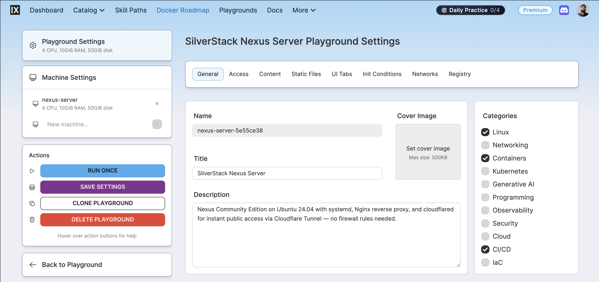
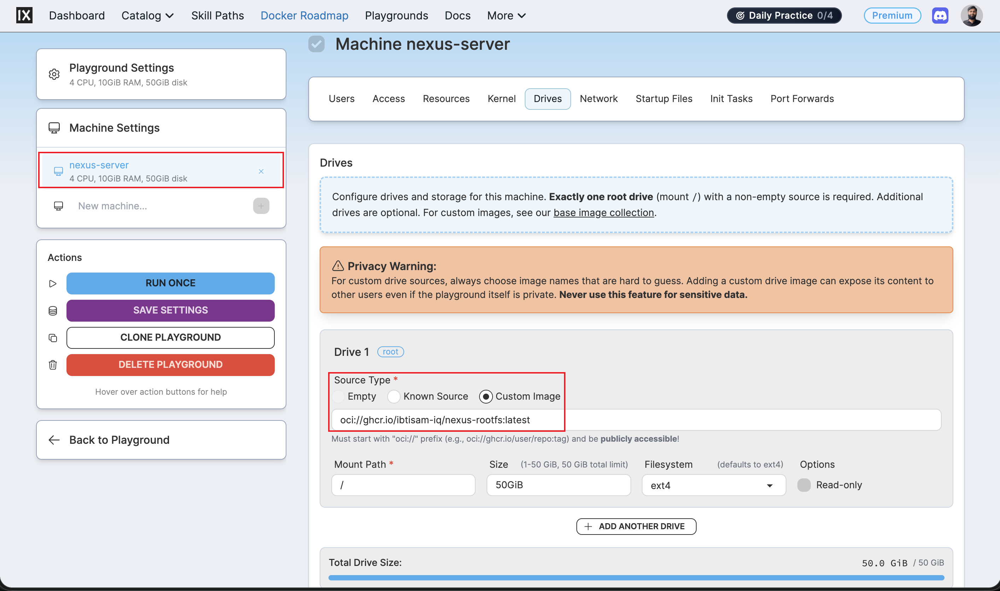
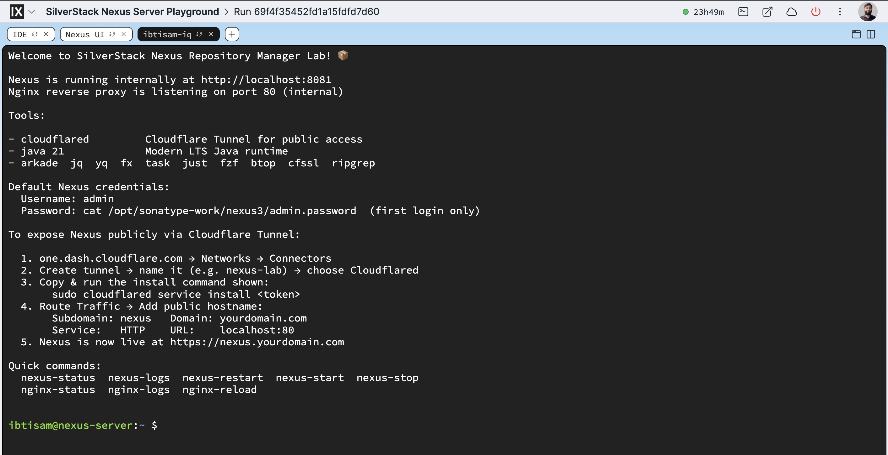

# Nexus Repository Manager Rootfs: Artifact Server Image Build and Integration

## Context

Nexus Repository Manager Rootfs is a **production‑grade Nexus 3 Community Edition image for iximiuz playgrounds**.

It runs on top of `ubuntu-24-04-rootfs`, booting `lab-init` → `nginx` → `nexus` via systemd, with Nginx on port 80 and `cloudflared` pre‑installed for Cloudflare Tunnel custom‑domain access.



It is defined under:

- README: [`iximiuz/rootfs/nexus/README.md`](https://github.com/ibtisam-iq/silver-stack/blob/main/iximiuz/rootfs/nexus/README.md)
- Dockerfile: [`iximiuz/rootfs/nexus/Dockerfile`](https://github.com/ibtisam-iq/silver-stack/blob/main/iximiuz/rootfs/nexus/Dockerfile)
- Scripts: [`iximiuz/rootfs/nexus/scripts/`](https://github.com/ibtisam-iq/silver-stack/tree/main/iximiuz/rootfs/nexus/scripts)
- Configs: [`iximiuz/rootfs/nexus/configs/`](https://github.com/ibtisam-iq/silver-stack/tree/main/iximiuz/rootfs/nexus/configs)
    - Nginx: [`configs/nginx.conf`](https://github.com/ibtisam-iq/silver-stack/blob/main/iximiuz/rootfs/nexus/configs/nginx.conf)
    - Nexus unit: [`configs/nexus.service`](https://github.com/ibtisam-iq/silver-stack/blob/main/iximiuz/rootfs/nexus/configs/nexus.service)
    - lab-init unit: [`configs/systemd/lab-init.service`](https://github.com/ibtisam-iq/silver-stack/blob/main/iximiuz/rootfs/nexus/configs/systemd/lab-init.service)
    - sudoers: [`configs/sudoers.d/nexus-user`](https://github.com/ibtisam-iq/silver-stack/blob/main/iximiuz/rootfs/nexus/configs/sudoers.d/nexus-user)
- Welcome banner: [`iximiuz/rootfs/nexus/welcome`](https://github.com/ibtisam-iq/silver-stack/blob/main/iximiuz/rootfs/nexus/welcome)
- iximiuz manifest: [`iximiuz/manifests/nexus-server.yml`](https://github.com/ibtisam-iq/silver-stack/blob/main/iximiuz/manifests/nexus-server.yml)
- CI workflow: [`.github/workflows/build-nexus-rootfs.yml`](https://github.com/ibtisam-iq/silver-stack/blob/main/.github/workflows/build-nexus-rootfs.yml)

Nexus uses its **embedded storage** under `/opt/sonatype-work` and does not require an external database.

---

## Objectives

Nexus Rootfs must:

- Provide a **Nexus 3.89.1‑02 CE** repository server running as `nexus` user on top of `ubuntu-24-04-rootfs`.
- Boot in the sequence `lab-init` → `nginx` → `nexus` via systemd, exposing Nexus through Nginx on port 80.
- Allow easy Cloudflare Tunnel exposure using a pre‑installed `cloudflared` binary and a guided welcome banner.
- Support secure operations by giving the `nexus` daemon a **limited sudo profile** for service management and log access.
- Be built reproducibly via CI, multi‑arch, and published to GHCR as `ghcr.io/ibtisam-iq/nexus-rootfs` with LTS‑style tags for the chosen Nexus version.

---

## Architecture / Conceptual Overview

The Nexus rootfs image:

- Inherits all base behavior (systemd, SSH, prompt, tools, non‑root user `ibtisam`) from `ghcr.io/ibtisam-iq/ubuntu-24-04-rootfs:latest`.
- Adds Nexus‑specific components:
    - Java 21 OpenJDK runtime (`JAVA_HOME` set to `/usr/lib/jvm/java-21-openjdk-amd64`).
    - Nexus 3.89.1‑02 CE, installed under `/opt/nexus` with data at `/opt/sonatype-work/nexus3`.
    - Nginx reverse proxy mapping port 80 to internal `__NEXUS_PORT__` (default `8081`).
    - `cloudflared` for Cloudflare Tunnel integration.

Systemd units:

- `lab-init.service` (`configs/systemd/lab-init.service`) - one‑shot init calling `/opt/nexus-scripts/lab-init.sh` before SSH, Nginx, and Nexus.
- `nexus.service` (`configs/nexus.service`) - runs `/opt/nexus/bin/nexus run` as `nexus` user, with tuned limits and `OOMScoreAdjust=-900`.
- `nginx.service` - from base image, enabled here as a dependency.

Nginx proxy:

- Configuration in [`configs/nginx.conf`](https://github.com/ibtisam-iq/silver-stack/blob/main/iximiuz/rootfs/nexus/configs/nginx.conf) defines an upstream `nexus` pointing at `127.0.0.1:__NEXUS_PORT__`, and exposes `/health` for health checks.

Sudo profile for `nexus`:

- [`configs/sudoers.d/nexus-user`](https://github.com/ibtisam-iq/silver-stack/blob/main/iximiuz/rootfs/nexus/configs/sudoers.d/nexus-user) grants passwordless sudo only for Nexus and Nginx systemd operations and `journalctl`.

Welcome banner:

- [`iximiuz/rootfs/nexus/welcome`](https://github.com/ibtisam-iq/silver-stack/blob/main/iximiuz/rootfs/nexus/welcome) explains internal URLs, default admin password retrieval, Cloudflare Tunnel setup, and pre‑defined helper aliases like `nexus-status` and `nginx-reload`.

---

## Source Layout and Inputs

From [`iximiuz/rootfs/nexus/README.md`](https://github.com/ibtisam-iq/silver-stack/blob/main/iximiuz/rootfs/nexus/README.md):

```text
nexus/
├── Dockerfile
├── welcome
├── configs/
│   ├── nginx.conf                  # Upstream: 127.0.0.1:__NEXUS_PORT__
│   ├── nexus.service
│   ├── sudoers.d/
│   │   └── nexus-user
│   └── systemd/
│       └── lab-init.service
└── scripts/
    ├── install-nexus.sh            # Java 21 + Nexus OSS (arch-aware)
    ├── configure-nginx.sh          # Enables site, systemd override
    ├── lab-init.sh                 # SSH keys + runtime dir setup
    ├── healthcheck.sh              # Build-time validation (8 sections)
    ├── customize-bashrc.sh         # Aliases → ~/.bashrc
    └── install-cloudflared.sh
```

Key paths:

- Dockerfile - [`iximiuz/rootfs/nexus/Dockerfile`](https://github.com/ibtisam-iq/silver-stack/blob/main/iximiuz/rootfs/nexus/Dockerfile)
- Scripts - [`iximiuz/rootfs/nexus/scripts/`](https://github.com/ibtisam-iq/silver-stack/tree/main/iximiuz/rootfs/nexus/scripts)
- Configs - [`iximiuz/rootfs/nexus/configs/`](https://github.com/ibtisam-iq/silver-stack/tree/main/iximiuz/rootfs/nexus/configs)
- Welcome - [`iximiuz/rootfs/nexus/welcome`](https://github.com/ibtisam-iq/silver-stack/blob/main/iximiuz/rootfs/nexus/welcome)

---

## Prerequisites

To build Nexus Rootfs:

- Base image `ghcr.io/ibtisam-iq/ubuntu-24-04-rootfs:latest` must already exist.
- Local clone of `github.com/ibtisam-iq/silver-stack` with the `iximiuz/rootfs/nexus` directory.
- Docker with Buildx (for multi‑arch builds if mirroring CI).
- Network access to download Nexus binaries and dependencies (`install-nexus.sh`, `install-cloudflared.sh`, etc.).

---

## Installation / Build Steps

### 1. Local Nexus Rootfs build

From `iximiuz/rootfs/nexus`:

```bash
IMAGE_NAME="ghcr.io/ibtisam-iq/nexus-rootfs:latest"

docker build \
  --build-arg USER="ibtisam" \
  --build-arg NEXUS_PORT="8081" \
  -t "${IMAGE_NAME}" \
  .
```

The Dockerfile
[`iximiuz/rootfs/nexus/Dockerfile`](https://github.com/ibtisam-iq/silver-stack/blob/main/iximiuz/rootfs/nexus/Dockerfile)
performs these major steps:

1. **Base and environment**

    - `FROM ghcr.io/ibtisam-iq/ubuntu-24-04-rootfs:latest`.
    - `USER root`.
    - Build args: `USER`, `NEXUS_PORT`, `BUILD_DATE`, `VCS_REF`.
    - Labels: `created` and `revision` from build args.
    - Environment variables:
        - `NEXUS_HOME=/opt/nexus`
        - `NEXUS_DATA=/opt/sonatype-work`
        - `NEXUS_PORT=${NEXUS_PORT:-8081}`
        - `JAVA_HOME=/usr/lib/jvm/java-21-openjdk-amd64`
        - `PATH` updated with Java bin
        - `TZ=UTC`.

2. **Copy and parameterize configs**

    - Copies `configs/nginx.conf` to `/etc/nginx/sites-available/nexus` and runs `sed` to replace `__NEXUS_PORT__` with `NEXUS_PORT`.
    - Copies `configs/nexus.service` to `/etc/systemd/system/nexus.service`.
    - Copies `configs/sudoers.d/nexus-user` into `/etc/sudoers.d/nexus-user`.
    - Copies `configs/systemd/lab-init.service` into `/etc/systemd/system/lab-init.service`.

3. **Copy and prepare scripts**

    - Copies `scripts/` to `/opt/nexus-scripts/` and marks all scripts as executable.

4. **Install Java and Nexus**

    - Executes `/opt/nexus-scripts/install-nexus.sh ${NEXUS_PORT}` to install Java and Nexus CE, set up the `nexus` user, and configure Nexus to listen on the configured port.

5. **Configure Nginx**

    - Runs `/opt/nexus-scripts/configure-nginx.sh` to enable the Nexus site, tune proxies, and wire Nginx into systemd.

6. **Enable services for boot**

    - Enables `lab-init`, `nginx`, and `nexus` via `systemctl enable` so systemd boot order is: lab init → Nginx → Nexus.

7. **Healthcheck and cloudflared**

    - Runs `/opt/nexus-scripts/healthcheck.sh ${USER}` to validate Java, Nexus, Nginx, and file permissions.
    - Executes `/opt/nexus-scripts/install-cloudflared.sh` to install `cloudflared`.

8. **User home and shell customization**

    - `chown -R ${USER}:${USER} /home/${USER}` to fix ownership for any files written during build.
    - Switches to `USER $USER` and sets `HOME=/home/$USER`.
    - Copies `welcome` to `$HOME/.welcome` and replaces `__NEXUS_PORT__` with `NEXUS_PORT`.
    - Binds `scripts/` as `/tmp/scripts` and runs `customize-bashrc.sh` for aliases and helper functions.

9. **Return to root and finalize**

    - Switches back to `USER root` since systemd must run as root.
    - Exposes ports `22`, `80`, and `NEXUS_PORT`.
    - `CMD ["/lib/systemd/systemd"]` as entrypoint.

> **Why this matters:** This ordering is what ensures your image boots cleanly in iximiuz with all services online and healthcheck scripts passing.

---

### 2. Build and push via GitHub Actions

The CI build is defined in
[`.github/workflows/build-nexus-rootfs.yml`](https://github.com/ibtisam-iq/silver-stack/blob/main/.github/workflows/build-nexus-rootfs.yml).

Key behavior:

- **Triggers**
    - `push` to `main` affecting `iximiuz/rootfs/nexus/**` (excluding `README.md`) or the workflow itself.
    - `pull_request` with the same paths.
    - Manual `workflow_dispatch`.

- **Environment**
    - `IMAGE_NAME` is `ghcr.io/${{ github.repository_owner }}/nexus-rootfs`.

- **Build steps**
    - Checkout repo.
    - Set up QEMU and Buildx for `amd64` and `arm64`.
    - Log in to GHCR using `secrets.GITHUB_TOKEN`.
    - `docker/metadata-action` generates tags and labels, including:
        - `latest` on default branch.
        - `3.89.1.02-community` tag.
        - `community` tag.
        - `sha-<short-sha>` tag.
        - `YYYY-MM-DD` date tag.
        - Label `org.opencontainers.image.base.name=ghcr.io/ibtisam-iq/ubuntu-24-04-rootfs:latest`.
    - `docker/build-push-action` builds with:
        - `context: ./iximiuz/rootfs/nexus`
        - `file: ./iximiuz/rootfs/nexus/Dockerfile`
        - `platforms: linux/amd64,linux/arm64`
        - `build-args: USER=ibtisam, NEXUS_PORT=8081`
        - `push: true` on non‑PR events.
    - Prints the image digest when done.

> **Why this matters:** Ensuring your local build args match CI keeps behavior consistent between local testing and iximiuz usage.

---

## Verification

### Local container test

From [`iximiuz/rootfs/nexus/README.md`](https://github.com/ibtisam-iq/silver-stack/blob/main/iximiuz/rootfs/nexus/README.md):

```bash
docker run -d \
  --name nexus-test \
  --privileged \
  --cgroupns=host \
  -v /sys/fs/cgroup:/sys/fs/cgroup \
  --tmpfs /tmp \
  --tmpfs /run \
  --tmpfs /run/lock \
  -p 8081:80 \
  -p 9022:22 \
  ghcr.io/ibtisam-iq/nexus-rootfs:latest

# Check services
docker exec nexus-test systemctl is-active lab-init nginx nexus

# Get initial admin password
docker exec nexus-test \
  cat /opt/sonatype-work/nexus3/admin.password

# Test Nginx reverse proxy
docker exec nexus-test curl -f http://localhost/health

# Nexus UI in browser
open http://localhost:8081
```

> **Why this matters:** Confirms systemd chain, Nginx → Nexus proxy, the health endpoint, and initial admin password path before iximiuz usage.

### GHCR image check

```bash
skopeo inspect docker://ghcr.io/ibtisam-iq/nexus-rootfs:community \
  | jq '.Name,.Labels."org.opencontainers.image.base.name"'
```

Expected base name label: `ghcr.io/ibtisam-iq/ubuntu-24-04-rootfs:latest`.

---

## Integration with iximiuz Labs

Once the image is verified locally and pushed to GHCR, it can be launched as a custom iximiuz playground using the `labctl` CLI and a manifest file. Unlike iximiuz's built-in catalog labs, custom rootfs images cannot be started directly from the iximiuz UI - they require a manifest file to declare the machine drive source, resources, and tabs.

### Prerequisites

Before proceeding, ensure the following are in place on the machine from which you will run `labctl` commands:

1. **`labctl` is installed**
   ```bash
   # macOS
   brew install iximiuz/tools/labctl

   # Linux
   curl -sfL https://raw.githubusercontent.com/iximiuz/labctl/main/install.sh | sh
   ```
2. **`labctl` is authenticated**
   ```bash
   labctl auth login
   # Follow the one-time browser URL to complete authentication
   ```
   Verify the session:
   ```bash
   labctl auth whoami
   ```

---

### Step 1 - Create the playground

Download the manifest directly without cloning the full repository:

```bash
curl -fsSL https://raw.githubusercontent.com/ibtisam-iq/silver-stack/main/iximiuz/manifests/nexus-server.yml \
  -o nexus-server.yml
```

The manifest declares a single machine `nexus-server` whose root drive is mounted directly from the published GHCR image:

```yaml
drives:
  - source: oci://ghcr.io/ibtisam-iq/nexus-rootfs:latest
    mount: /
    size: 50GiB
```

The manifest can be edited before running - for example, to adjust `cpuCount`, `ramSize`, or `size` to match account quota or preferences.

Run `labctl playground create` pointing at the local manifest:

```bash
labctl playground create --base flexbox nexus-server -f nexus-server.yml
```

When the command succeeds, `labctl` prints the playground URL and its unique ID:

```
Creating playground from /path/to/<MANIFEST_FILENAME>
Playground URL: https://labs.iximiuz.com/playgrounds/nexus-server-<unique-id>
nexus-server-<unique-id>
```

> **Note:** The playground does **not** appear under **Playgrounds → Running**.
> Custom playgrounds created via `labctl` appear under **Playgrounds → My Custom**.

---

### Step 2 - Open the playground

Click the URL printed by `labctl`, or navigate manually:

1. Open [labs.iximiuz.com/dashboard](https://labs.iximiuz.com/dashboard).
2. In the dashboard navigation bar, click **Playgrounds**.
3. Under Playgrounds, click the **My Custom** tab.
4. Locate the playground by the `title` set in the manifest file
   (e.g., `SilverStack Nexus Server`). If the manifest title was
   customized before running, look for that name instead.
5. The playground card shows a **Start** button and a three-dot menu (⋮).

To start immediately, click **Start**.

To review or adjust settings before starting, click ⋮ → **Configure**. This opens the Playground Settings page where machine drives, resources, network, and UI tabs can be inspected before launch.



---

### Step 3 - Verify the running playground

Once started, the welcome banner is displayed automatically and shows the configured internal
ports, service status commands, and next steps.

Follow the instructions in the welcome file for post-setup tasks:
[`iximiuz/rootfs/nexus/welcome`](https://github.com/ibtisam-iq/silver-stack/blob/main/iximiuz/rootfs/nexus/welcome)



---

## Cloudflare Tunnel Configuration

To expose the service on a custom public domain, `cloudflared` is already installed in the image. The welcome page includes step-by-step instructions for configuring and connecting the tunnel. Follow those instructions on first login.

If any issues arise during Cloudflare Tunnel setup, refer to phase 4 in the following runbook:

> 📖 [self-hosted-cicd-stack-journey-from-ec2-to-iximiuz-labs.md](../../../self-hosted/ci-cd/iximiuz/self-hosted-cicd-stack-journey-from-ec2-to-iximiuz-labs.md#phase-4-implementation---creating-cloudflare-tunnels)

---

## Related

- Nexus Rootfs README - [`iximiuz/rootfs/nexus/README.md`](https://github.com/ibtisam-iq/silver-stack/blob/main/iximiuz/rootfs/nexus/README.md)
- Nexus Dockerfile - [`iximiuz/rootfs/nexus/Dockerfile`](https://github.com/ibtisam-iq/silver-stack/blob/main/iximiuz/rootfs/nexus/Dockerfile)
- Nexus scripts - [`iximiuz/rootfs/nexus/scripts/`](https://github.com/ibtisam-iq/silver-stack/tree/main/iximiuz/rootfs/nexus/scripts)
- Nexus configs - [`iximiuz/rootfs/nexus/configs/`](https://github.com/ibtisam-iq/silver-stack/tree/main/iximiuz/rootfs/nexus/configs)
- Nexus welcome - [`iximiuz/rootfs/nexus/welcome`](https://github.com/ibtisam-iq/silver-stack/blob/main/iximiuz/rootfs/nexus/welcome)
- Build workflow - [`.github/workflows/build-nexus-rootfs.yml`](https://github.com/ibtisam-iq/silver-stack/blob/main/.github/workflows/build-nexus-rootfs.yml)
- Nexus iximiuz manifest - [`iximiuz/manifests/nexus-server.yml`](https://github.com/ibtisam-iq/silver-stack/blob/main/iximiuz/manifests/nexus-server.yml)
