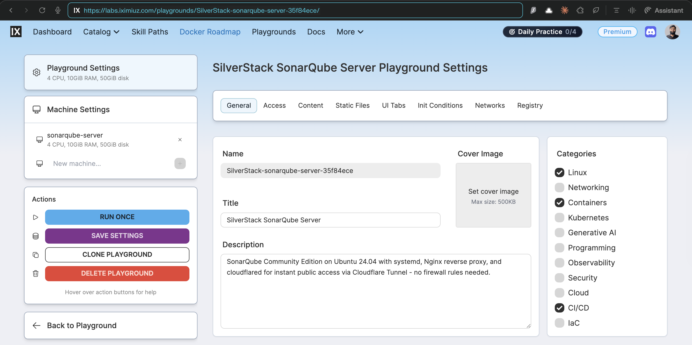
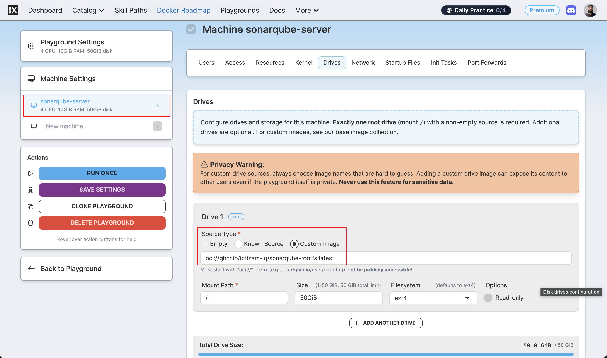
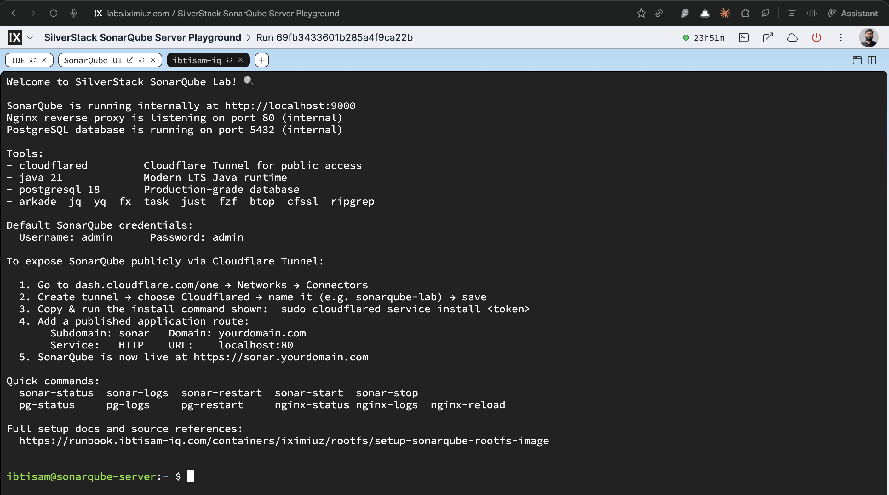

# SonarQube Community Edition Rootfs: Code Quality Server Image Build and Integration

## Context

SonarQube Community Edition Rootfs is a **production‑grade SonarQube LTA image for iximiuz playgrounds**.

It runs SonarQube on top of PostgreSQL 18 and Nginx, all managed by systemd, with `cloudflared` pre‑installed for Cloudflare Tunnel custom‑domain access.



It is defined under:

- README: [`iximiuz/rootfs/sonarqube/README.md`](https://github.com/ibtisam-iq/silver-stack/blob/main/iximiuz/rootfs/sonarqube/README.md)
- Dockerfile: [`iximiuz/rootfs/sonarqube/Dockerfile`](https://github.com/ibtisam-iq/silver-stack/blob/main/iximiuz/rootfs/sonarqube/Dockerfile)
- Scripts: [`iximiuz/rootfs/sonarqube/scripts/`](https://github.com/ibtisam-iq/silver-stack/tree/main/iximiuz/rootfs/sonarqube/scripts)
- Configs: [`iximiuz/rootfs/sonarqube/configs/`](https://github.com/ibtisam-iq/silver-stack/tree/main/iximiuz/rootfs/sonarqube/configs)
    - SonarQube unit: [`configs/sonarqube.service`](https://github.com/ibtisam-iq/silver-stack/blob/main/iximiuz/rootfs/sonarqube/configs/sonarqube.service)
    - lab-init unit: [`configs/systemd/lab-init.service`](https://github.com/ibtisam-iq/silver-stack/blob/main/iximiuz/rootfs/sonarqube/configs/systemd/lab-init.service)
    - sudoers: [`configs/sudoers.d/sonarqube-user`](https://github.com/ibtisam-iq/silver-stack/blob/main/iximiuz/rootfs/sonarqube/configs/sudoers.d/sonarqube-user)
    - Nginx config: [`configs/nginx.conf`](https://github.com/ibtisam-iq/silver-stack/blob/main/iximiuz/rootfs/sonarqube/configs/nginx.conf)
    - SonarQube config: [`configs/sonar.properties`](https://github.com/ibtisam-iq/silver-stack/blob/main/iximiuz/rootfs/sonarqube/configs/sonar.properties)
- Welcome banner: [`iximiuz/rootfs/sonarqube/welcome`](https://github.com/ibtisam-iq/silver-stack/blob/main/iximiuz/rootfs/sonarqube/welcome)
- iximiuz manifest: [`iximiuz/manifests/sonarqube-server.yml`](https://github.com/ibtisam-iq/silver-stack/blob/main/iximiuz/manifests/sonarqube-server.yml)
- CI workflow: [`.github/workflows/build-sonarqube-rootfs.yml`](https://github.com/ibtisam-iq/silver-stack/blob/main/.github/workflows/build-sonarqube-rootfs.yml)

The image brings up **PostgreSQL, SonarQube, and Nginx** in one VM, with SonarQube available on port 80 via Nginx and on `__SONARQUBE_PORT__` internally.

---

## Objectives

SonarQube Rootfs must:

- Provide **SonarQube 26.2 Community Edition (LTA)** running on PostgreSQL 18 and Java 21, on top of `ubuntu-24-04-rootfs`.
- Start services in the order `lab-init` → `postgresql` → `nginx` → `sonarqube` via systemd.
- Configure SonarQube with a dedicated database `sonarqube` and role `sonar`, initialized at runtime by `lab-init.sh`.
- Expose SonarQube through Nginx on port 80 and provide a `/health` endpoint for liveness checks.
- Provide a pre‑installed `cloudflared` with a clear workflow in the welcome banner for Cloudflare Tunnel exposure.
- Give the `sonar` daemon user a **limited sudo profile** for managing SonarQube, PostgreSQL, Nginx, and `journalctl` only.
- Be built reproducibly using the CI workflow and published as `ghcr.io/ibtisam-iq/sonarqube-rootfs` with versioned and `community` tags.

---

## Architecture / Conceptual Overview

This image is a **three‑tier stack in a single VM**:

- **Base OS & tools** - inherited from `ghcr.io/ibtisam-iq/ubuntu-24-04-rootfs:latest` (systemd, SSH, shell tools, non‑root `ibtisam`).
- **Data tier** - PostgreSQL 18 installed via `install-postgresql.sh`, running as `postgres` system user, database `sonarqube` and role `sonar` created at boot by `lab-init.sh`.
- **App tier** - SonarQube 26.2 CE installed under `/opt/sonarqube`, running as `sonar` user, configured via `configs/sonar.properties`.
- **Edge tier** - Nginx reverse proxy serving on port 80 and forwarding to internal `__SONARQUBE_PORT__` (default 9000), plus `/health` endpoint.

Systemd units:

- `lab-init.service` - [`configs/systemd/lab-init.service`](https://github.com/ibtisam-iq/silver-stack/blob/main/iximiuz/rootfs/sonarqube/configs/systemd/lab-init.service) - one‑shot init that runs `/opt/sonarqube-scripts/lab-init.sh` before PostgreSQL, Nginx, and SonarQube.
- `postgresql.service` - installed/configured by `install-postgresql.sh`.
- `sonarqube.service` - [`configs/sonarqube.service`](https://github.com/ibtisam-iq/silver-stack/blob/main/iximiuz/rootfs/sonarqube/configs/sonarqube.service) - runs `/opt/sonarqube/bin/linux-x86-64/sonar.sh console` as `sonar` user with tuned resource limits.
- `nginx.service` - provisioned by the base image and further configured by `configure-nginx.sh` and `configs/nginx.conf`.

The **welcome banner** explains internal ports, default credentials, Cloudflare Tunnel steps, and helper commands like `sonar-status`, `pg-status`, and `nginx-reload`.

---

## Source Layout and Inputs

From [`iximiuz/rootfs/sonarqube/README.md`](https://github.com/ibtisam-iq/silver-stack/blob/main/iximiuz/rootfs/sonarqube/README.md):

```text
sonarqube/
├── Dockerfile
├── welcome
├── configs/
│   ├── nginx.conf                  # Upstream: 127.0.0.1:__SONARQUBE_PORT__
│   ├── sonarqube.service
│   ├── sonar.properties            # DB + web + ES + CE JVM options
│   ├── sudoers.d/
│   │   └── sonarqube-user
│   └── systemd/
│       └── lab-init.service
└── scripts/
    ├── install-postgresql.sh       # PG18 via PGDG apt repo
    ├── install-sonarqube.sh        # SonarQube LTA + sonar user
    ├── configure-nginx.sh          # Enables site, systemd override
    ├── lab-init.sh                 # SSH keys + DB init + sysctl
    ├── healthcheck.sh              # Build-time validation
    ├── customize-bashrc.sh         # Aliases → ~/.bashrc
    └── install-cloudflared.sh
```

Key paths:

- Dockerfile - [`iximiuz/rootfs/sonarqube/Dockerfile`](https://github.com/ibtisam-iq/silver-stack/blob/main/iximiuz/rootfs/sonarqube/Dockerfile)
- Scripts - [`iximiuz/rootfs/sonarqube/scripts/`](https://github.com/ibtisam-iq/silver-stack/tree/main/iximiuz/rootfs/sonarqube/scripts)
- Configs - [`iximiuz/rootfs/sonarqube/configs/`](https://github.com/ibtisam-iq/silver-stack/tree/main/iximiuz/rootfs/sonarqube/configs)
- Welcome - [`iximiuz/rootfs/sonarqube/welcome`](https://github.com/ibtisam-iq/silver-stack/blob/main/iximiuz/rootfs/sonarqube/welcome)

---

## Prerequisites

To build SonarQube Rootfs:

- Base image `ghcr.io/ibtisam-iq/ubuntu-24-04-rootfs:latest` must be built and available.
- Local clone of `github.com/ibtisam-iq/silver-stack` with the `iximiuz/rootfs/sonarqube` tree.
- Docker with Buildx (for multi‑arch builds).
- Network access to fetch PostgreSQL packages from PGDG and SonarQube binaries.

---

## Installation / Build Steps

### 1. Local SonarQube Rootfs build

From `iximiuz/rootfs/sonarqube`:

```bash
IMAGE_NAME="ghcr.io/ibtisam-iq/sonarqube-rootfs:latest"

docker build \
  --build-arg USER="ibtisam" \
  --build-arg SONARQUBE_PORT="9000" \
  -t "${IMAGE_NAME}" \
  .
```

The Dockerfile
[`iximiuz/rootfs/sonarqube/Dockerfile`](https://github.com/ibtisam-iq/silver-stack/blob/main/iximiuz/rootfs/sonarqube/Dockerfile)
performs these major steps:

1. **Base and environment**

    - `FROM ghcr.io/ibtisam-iq/ubuntu-24-04-rootfs:latest`.
    - `USER root`.
    - Build args: `USER`, `SONARQUBE_PORT`, `BUILD_DATE`, `VCS_REF`.
    - Labels: `created` and `revision`.
    - Environment variables:
        - `SONARQUBE_HOME=/opt/sonarqube`
        - `SONARQUBE_PORT=${SONARQUBE_PORT:-9000}`
        - `JAVA_HOME=/usr/lib/jvm/java-21-openjdk-amd64`
        - `PATH` updated for Java bin
        - `TZ=UTC`.

2. **Scripts and systemd units**

    - Copies all scripts to `/opt/sonarqube-scripts/` and marks them executable.
    - Copies `configs/sonarqube.service` to `/etc/systemd/system/sonarqube.service`.
    - Copies `configs/sudoers.d/sonarqube-user` to `/etc/sudoers.d/sonarqube-user`.
    - Copies `configs/systemd/lab-init.service` to `/etc/systemd/system/lab-init.service`.

3. **Install PostgreSQL**

    - Runs `/opt/sonarqube-scripts/install-postgresql.sh` to configure PGDG repo and install PostgreSQL 18.

4. **Install SonarQube**

    - Executes `/opt/sonarqube-scripts/install-sonarqube.sh ${SONARQUBE_PORT}` to install SonarQube 26.2 CE, create `sonar` user, and prepare directories.

5. **Apply SonarQube configuration**

    - Copies `configs/sonar.properties` into `/opt/sonarqube/conf/sonar.properties`.
    - Replaces `__SONARQUBE_PORT__` with `SONARQUBE_PORT` and sets owner to `sonar:sonar`.

6. **Configure Nginx**

    - Copies `configs/nginx.conf` to `/etc/nginx/sites-available/sonarqube` and replaces `__SONARQUBE_PORT__` with `SONARQUBE_PORT`.
    - Runs `/opt/sonarqube-scripts/configure-nginx.sh` to enable the SonarQube site and integrate it with systemd.

7. **Enable services on boot**

    - Enables `lab-init`, `postgresql`, `nginx`, and `sonarqube` using `systemctl enable`.

8. **Healthcheck and cloudflared**

    - Runs `/opt/sonarqube-scripts/healthcheck.sh ${USER}` to validate PostgreSQL, SonarQube, Nginx, and sysctl configuration.
    - Executes `/opt/sonarqube-scripts/install-cloudflared.sh` to install `cloudflared`.

9. **User home and shell customization**

    - `chown -R ${USER}:${USER} /home/${USER}` to repair home ownership.
    - Switches to `USER $USER`, `HOME=/home/$USER`.
    - Copies `welcome` to `$HOME/.welcome` and substitutes `__SONARQUBE_PORT__` with `SONARQUBE_PORT`.
    - Binds `scripts/` as `/tmp/scripts` and runs `customize-bashrc.sh` to add aliases and shortcuts.

10. **Return to root and finalize**

    - Switches back to `USER root` so systemd can run as PID 1.
    - Exposes ports `22`, `80`, and `SONARQUBE_PORT`.
    - `CMD ["/lib/systemd/systemd"]`.

> **Why this matters:** SonarQube’s embedded Elasticsearch requires specific sysctl and service ordering; this build flow guarantees those preconditions via `lab-init` + healthcheck.

---

### 2. Build and push via GitHub Actions

CI build is defined in
[`.github/workflows/build-sonarqube-rootfs.yml`](https://github.com/ibtisam-iq/silver-stack/blob/main/.github/workflows/build-sonarqube-rootfs.yml).

Key behavior:

- **Triggers**
    - `push` to `main` when files under `iximiuz/rootfs/sonarqube/**` (except `README.md`) or the workflow file change.
    - `pull_request` on the same paths.
    - `workflow_dispatch` for manual runs.

- **Environment**
    - `IMAGE_NAME = ghcr.io/${{ github.repository_owner }}/sonarqube-rootfs`.

- **Build steps**
    - Checkout repo.
    - Set up QEMU and Buildx for `amd64` and `arm64`.
    - Log in to GHCR.
    - Use `docker/metadata-action` to generate tags and labels, including:
        - `latest` on default branch.
        - `26.2.0-community` tag.
        - `community` tag.
        - `sha-<short-sha>` and date tags.
        - Base image label `ghcr.io/ibtisam-iq/ubuntu-24-04-rootfs:latest`.
    - Use `docker/build-push-action` with:
        - `context: ./iximiuz/rootfs/sonarqube`
        - `file: ./iximiuz/rootfs/sonarqube/Dockerfile`
        - `platforms: linux/amd64,linux/arm64`
        - `build-args: USER=ibtisam, SONARQUBE_PORT=9000`
        - Cache from/to `gha`.
        - `push: true` on non‑PR events.
    - Print the final image digest.

> **Why this matters:** Keeping local build args consistent with the workflow avoids discrepancies between local testing and what iximiuz pulls from GHCR.

---

## Verification

### Local container test

From the README:

```bash
docker run -d \
  --name sonarqube-test \
  --privileged \
  --cgroupns=host \
  -v /sys/fs/cgroup:/sys/fs/cgroup \
  --tmpfs /tmp \
  --tmpfs /run \
  --tmpfs /run/lock \
  -p 9000:80 \
  -p 8022:22 \
  ghcr.io/ibtisam-iq/sonarqube-rootfs:latest

# Wait ~30s for SonarQube to start
docker exec sonarqube-test systemctl is-active lab-init postgresql nginx sonarqube

# Verify PostgreSQL database
docker exec sonarqube-test su - postgres -c "psql -c '\l'"

# SonarQube health
docker exec sonarqube-test \
  curl -u admin:admin http://localhost:9000/api/system/health

# Nginx health
docker exec sonarqube-test curl -f http://localhost/health

# UI in browser
open http://localhost:9000
```

You should see:

- All four services active.
- PostgreSQL listing includes `sonarqube` database.
- `/api/system/health` returning `GREEN` once fully initialized.
- `/health` returning `"healthy"`.

### GHCR image check

```bash
skopeo inspect docker://ghcr.io/ibtisam-iq/sonarqube-rootfs:community \
  | jq '.Name,.Labels."org.opencontainers.image.base.name"'
```

Base label should be `ghcr.io/ibtisam-iq/ubuntu-24-04-rootfs:latest`.

---

## Integration with iximiuz Labs

Once the image is verified locally and pushed to GHCR, it can be launched as a custom iximiuz playground using the `labctl` CLI and a manifest file. Unlike iximiuz's built-in catalog labs, custom rootfs images cannot be started directly from the iximiuz UI - they require a manifest file to declare the machine drive source, resources, and tabs.

### Prerequisites

Before proceeding, ensure the following are in place on the machine from which you will run `labctl` commands:

1. **`labctl` is installed**
   ```bash
   # macOS
   brew install iximiuz/tools/labctl

   # Linux
   curl -sfL https://raw.githubusercontent.com/iximiuz/labctl/main/install.sh | sh
   ```
2. **`labctl` is authenticated**
   ```bash
   labctl auth login
   # Follow the one-time browser URL to complete authentication
   ```
   Verify the session:
   ```bash
   labctl auth whoami
   ```

---

### Step 1 - Create the playground

Download the manifest directly without cloning the full repository:

```bash
curl -fsSL https://raw.githubusercontent.com/ibtisam-iq/silver-stack/main/iximiuz/manifests/sonarqube-server.yml \
  -o sonarqube-server.yml
```

The manifest declares a single machine `sonarqube-server` whose root drive is mounted directly from the published GHCR image:

```yaml
drives:
  - source: oci://ghcr.io/ibtisam-iq/sonarqube-rootfs:latest
    mount: /
    size: 50GiB
```

The manifest can be edited before running - for example, to adjust `cpuCount`, `ramSize`, or `size` to match account quota or preferences.

Run `labctl playground create` pointing at the local manifest:

```bash
labctl playground create --base flexbox sonarqube-server -f sonarqube-server.yml
```

When the command succeeds, `labctl` prints the playground URL and its unique ID:

```
Creating playground from /path/to/<MANIFEST_FILENAME>
Playground URL: https://labs.iximiuz.com/playgrounds/sonarqube-server-<unique-id>
sonarqube-server-<unique-id>
```

> **Note:** The playground does **not** appear under **Playgrounds → Running**.
> Custom playgrounds created via `labctl` appear under **Playgrounds → My Custom**.

---

### Step 2 - Open the playground

Click the URL printed by `labctl`, or navigate manually:

1. Open [labs.iximiuz.com/dashboard](https://labs.iximiuz.com/dashboard).
2. In the dashboard navigation bar, click **Playgrounds**.
3. Under Playgrounds, click the **My Custom** tab.
4. Locate the playground by the `title` set in the manifest file
   (e.g., `SilverStack SonarQube Server`). If the manifest title was
   customized before running, look for that name instead.
5. The playground card shows a **Start** button and a three-dot menu (⋮).

To start immediately, click **Start**.

To review or adjust settings before starting, click ⋮ → **Configure**. This opens the Playground Settings page where machine drives, resources, network, and UI tabs can be inspected before launch.



---

### Step 3 - Verify the running playground

Once started, the welcome banner is displayed automatically and shows the configured internal
ports, service status commands, and next steps.

Follow the instructions in the welcome file for post-setup tasks:
[`iximiuz/rootfs/sonarqube/welcome`](https://github.com/ibtisam-iq/silver-stack/blob/main/iximiuz/rootfs/sonarqube/welcome)



---

## Cloudflare Tunnel Configuration

To expose the service on a custom public domain, `cloudflared` is already installed in the image. The welcome page includes step-by-step instructions for configuring and connecting the tunnel. Follow those instructions on first login.

If any issues arise during Cloudflare Tunnel setup, refer to phase 4 in the following runbook:

> 📖 [self-hosted-cicd-stack-journey-from-ec2-to-iximiuz-labs.md](../../../self-hosted/ci-cd/iximiuz/self-hosted-cicd-stack-journey-from-ec2-to-iximiuz-labs.md#phase-4-implementation---creating-cloudflare-tunnels)

---

## Related

- SonarQube Rootfs README - [`iximiuz/rootfs/sonarqube/README.md`](https://github.com/ibtisam-iq/silver-stack/blob/main/iximiuz/rootfs/sonarqube/README.md)
- SonarQube Dockerfile - [`iximiuz/rootfs/sonarqube/Dockerfile`](https://github.com/ibtisam-iq/silver-stack/blob/main/iximiuz/rootfs/sonarqube/Dockerfile)
- SonarQube scripts - [`iximiuz/rootfs/sonarqube/scripts/`](https://github.com/ibtisam-iq/silver-stack/tree/main/iximiuz/rootfs/sonarqube/scripts)
- SonarQube configs - [`iximiuz/rootfs/sonarqube/configs/`](https://github.com/ibtisam-iq/silver-stack/tree/main/iximiuz/rootfs/sonarqube/configs)
- SonarQube welcome - [`iximiuz/rootfs/sonarqube/welcome`](https://github.com/ibtisam-iq/silver-stack/blob/main/iximiuz/rootfs/sonarqube/welcome)
- Build workflow - [`.github/workflows/build-sonarqube-rootfs.yml`](https://github.com/ibtisam-iq/silver-stack/blob/main/.github/workflows/build-sonarqube-rootfs.yml)
- SonarQube iximiuz manifest - [`iximiuz/manifests/sonarqube-server.yml`](https://github.com/ibtisam-iq/silver-stack/blob/main/iximiuz/manifests/sonarqube-server.yml)
