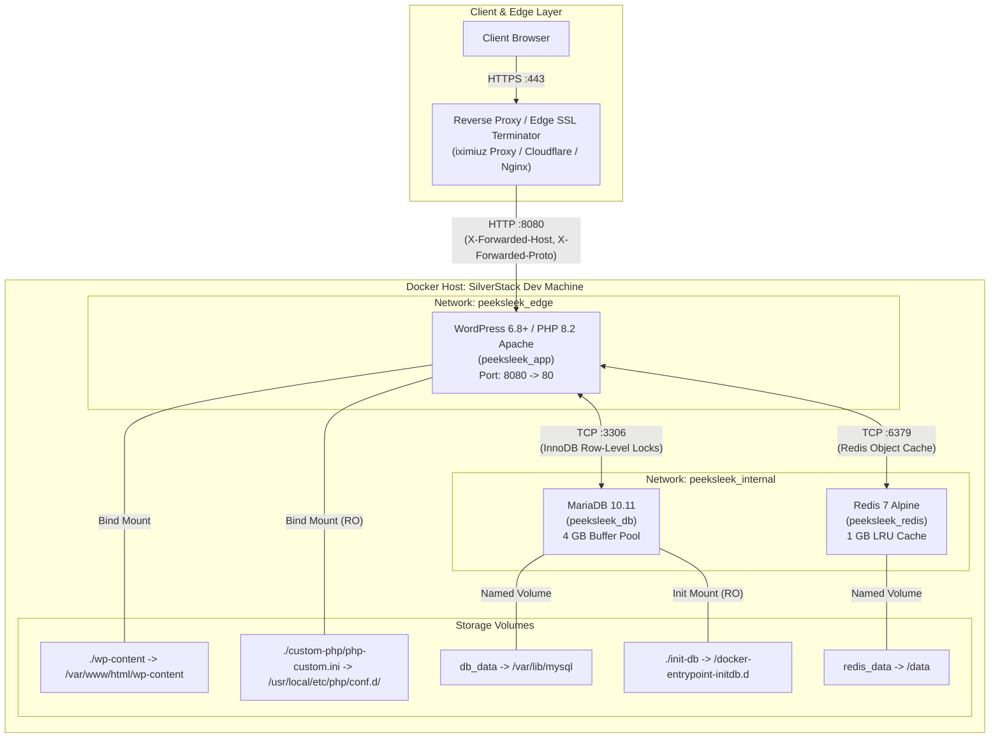

# Architecture & Design: High-Performance Multi-Container Topology

## Overview

Operating WooCommerce at scale demands strict separation of concerns, deterministic container lifecycle dependencies, and high-memory persistence optimizations. Unlike basic monolithic WordPress setups where PHP and MySQL share unmanaged local resources, this architecture isolates persistence, in-memory caching, and application runtimes into dedicated, resource-tuned containers connected across segmented bridge networks.

---

## Container Architecture Diagram



---

## Tier Specifications & Performance Tuning

### 1. Relational Database Tier: MariaDB 10.11 (`peeksleek_db`)

The database service is provisioned using official `mariadb:10.11` binaries, tuned specifically for read-heavy e-commerce catalog operations and concurrent WooCommerce transactional writes:

```yaml
    command: [
      --character-set-server=utf8mb4,
      --collation-server=utf8mb4_unicode_ci,
      --max_connections=300,
      --innodb_buffer_pool_size=4G,
      --innodb_log_file_size=512M,
      --innodb_flush_log_at_trx_commit=2,
      --tmp_table_size=256M,
      --max_heap_table_size=256M,
      --table_open_cache=4000
    ]
```

* **4 GB In-Memory Buffer Pool (`--innodb_buffer_pool_size=4G`):** Ensures that the entire working database set (including posts, postmeta, product variations, and customer orders) resides directly in RAM, eliminating disk I/O bottlenecks.
* **Transaction Commit Optimization (`--innodb_flush_log_at_trx_commit=2`):** Flushes logs to the OS cache every commit and to disk once per second, offering high write throughput for cart operations while maintaining system stability.
* **Concurrency Ceiling (`--max_connections=300`):** Accommodates concurrent shopper browsing without exhausting MariaDB thread pools.
* **Automated Seed Ingestion (`./init-db:/docker-entrypoint-initdb.d:ro`):** When the database volume is empty, MariaDB automatically imports the production SQL dump on initialization.

### 2. In-Memory Caching Tier: Redis 7 (`peeksleek_redis`)

To prevent repeated database queries for frequently accessed WordPress metadata, WooCommerce transients, and active cart sessions, a dedicated Redis instance runs alongside the application:

```yaml
    command: ["redis-server", "--appendonly", "yes", "--maxmemory", "1024mb", "--maxmemory-policy", "allkeys-lru"]
```

* **1 GB RAM Allocation (`--maxmemory 1024mb`):** Dedicated buffer for object caching.
* **Least Recently Used Eviction (`--maxmemory-policy allkeys-lru`):** Protects container stability by intelligently evicting stale cached transients when the memory limit is reached.
* **Data Durability (`--appendonly yes`):** Retains cached objects across planned container restarts.

### 3. Application Tier: WordPress / PHP 8.2 Apache (`peeksleek_app`)

The application layer runs the official Debian-based WordPress runtime on Apache and PHP 8.2:

* **Zend OPcache Enabled:** Pre-compiles PHP bytecode into shared memory (`opcache.memory_consumption=256`), eliminating compilation overhead per request.
* **High-Memory PHP Ceiling (`1024M`):** Prevents out-of-memory errors during complex Elementor page builder updates and batch WooCommerce catalog operations.
* **Dual Network Attachment:** Attached to `peeksleek_edge` for reverse-proxy routing and `peeksleek_internal` for private, non-exposed database and cache communication.

---

## Eliminating Container Race Conditions (`service_healthy`)

In multi-container stacks, a naive `depends_on: [db]` only verifies that the database container has created its initial process—not that MariaDB is ready to accept incoming TCP connections. 

If WordPress attempts to query MySQL before InnoDB initialization completes, it throws connection errors and breaks setup. This is solved declaratively using Docker healthchecks:

```yaml
    depends_on:
      db:
        condition: service_healthy
      redis:
        condition: service_healthy
```

* **MariaDB Healthcheck:** Utilizes `healthcheck.sh --connect --innodb_initialized` with a 5-second polling interval and 15-second start period.
* **Redis Healthcheck:** Pings the Redis daemon via `redis-cli ping` until a valid `PONG` response is received.
* **Execution Guarantee:** The WordPress application container will never start until MariaDB has initialized all storage engines and Redis is ready for object caching.
