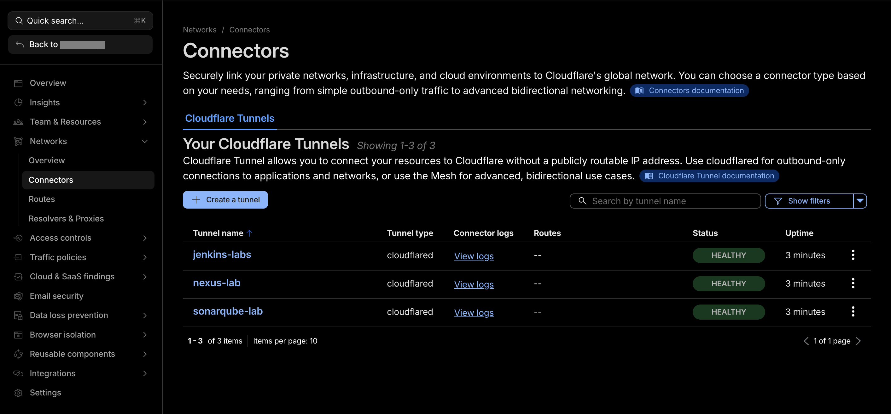
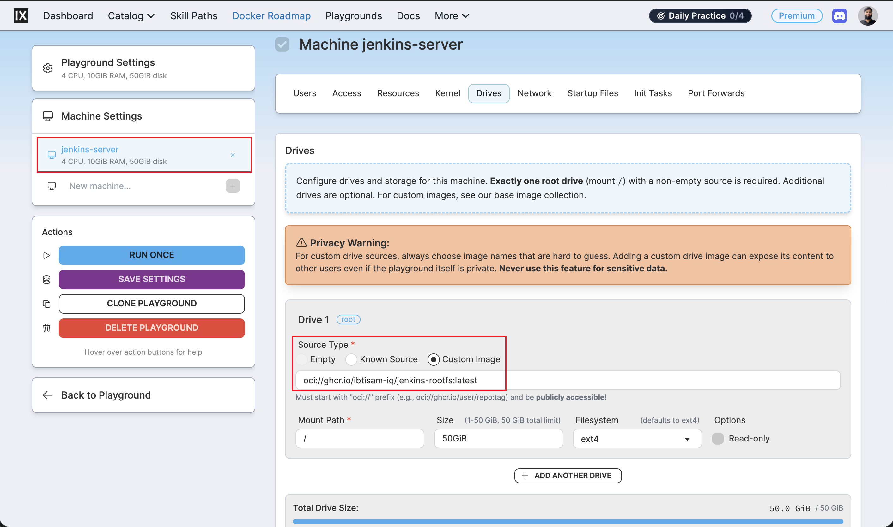
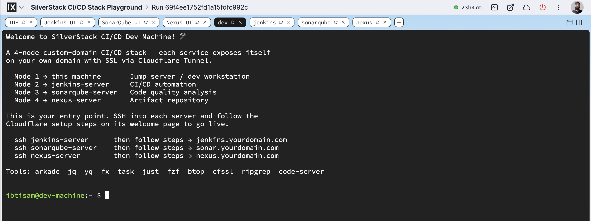
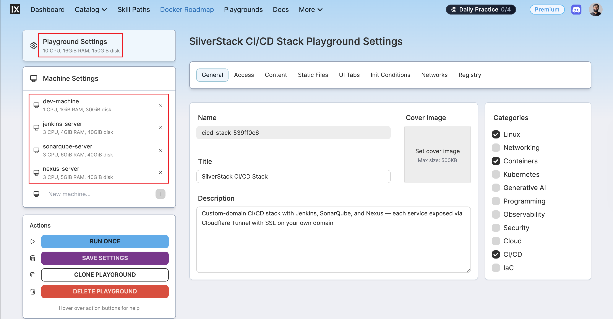

# Building a Self-Hosted CI/CD Stack Behind NAT: From EC2 to iximiuz Labs with Cloudflare Tunnel

This runbook documents my complete journey building a production-grade self-hosted CI/CD stack on iximiuz Labs, from initial EC2 testing to solving the NAT problem with Cloudflare Tunnel, and ultimately packaging everything into custom rootfs images.

## Context and Motivation

### The Original Goal

I wanted to build a self-hosted CI/CD stack consisting of Jenkins, SonarQube, and Nexus, each exposed on custom subdomains like `jenkins.ibtisam-iq.com`, `sonar.ibtisam-iq.com`, and `nexus.ibtisam-iq.com`.

My goal was complete control over the infrastructure rather than relying on cloud-managed CI/CD services.

### Why iximiuz Labs

During my CKA and CKAD certification preparation, I noticed that the official Kubernetes documentation had started recommending **iximiuz Labs** in the "Before you begin" section, alongside options like KodeKloud and Killercoda.

So, after passing both certifications, I wanted to move beyond exam scenarios and build real infrastructure. I explored iximiuz Labs' free tier and was impressed by its **custom rootfs support** and **persistent storage** capabilities - features that would allow me to define infrastructure as code and preserve state across sessions.

I invested in [lifetime premium](https://labs.iximiuz.com/pricing) access.

The **Flexbox playground** model proved ideal for this project: up to 5 nodes per playground sharing a local network (`172.16.0.0/24`), 24-hour runtime sessions, 100 GB persistent storage, and custom rootfs provisioning. This architecture allowed me to dedicate one node as a jump host and three others for Jenkins, SonarQube, and Nexus respectively.

## Phase 1: Proof of Concept on AWS EC2

### Initial Testing Approach

Before committing to the iximiuz environment, I spent 2-3 days validating the entire stack architecture on AWS EC2 instances. I spun up three separate EC2 instances and manually built the complete CI/CD stack, running each command one by one.

**What I installed on each server:**

- Jenkins LTS on the first EC2 instance
- SonarQube + PostgreSQL on the second
- Nexus Repository Manager on the third
- Nginx configured as a reverse proxy on all three (port 80 → service ports)
- Let's Encrypt SSL certificates via Certbot
- Cloudflare DNS management

I copied commands from official documentation, tested them, learned from failures, and iterated until everything worked.

### Why It Worked on EC2

EC2 instances have **public IP addresses**. This meant:

1. I could add the public IP to Cloudflare DNS as an A record
2. Certbot's HTTP-01 challenge could reach port 80 on my servers to validate domain ownership
3. Let's Encrypt issued SSL certificates successfully
4. Traffic routed cleanly: Browser → Cloudflare → Public IP → Nginx (port 80) → Service (8080, 9000, etc.)

The EC2 test proved the architecture was sound. I had working Nginx configurations, systemd service files, and startup scripts. This became my reference implementation to replicate on iximiuz Labs.

## Phase 2: Moving to iximiuz Labs - The NAT Discovery

### Attempting to Replicate the Setup

With the EC2 stack working, I attempted to replicate the exact same configuration on iximiuz Flexbox playground. I copied all my Nginx config files, systemd service definitions, and installation scripts to the iximiuz nodes.

Everything seemed to work locally - services started, Nginx responded on port 80, health checks passed. But when I tried to set up DNS and SSL, I hit an immediate problem.

### The Discovery

Unlike EC2 where the public IP is displayed in the instance metadata and console, **iximiuz Labs does not show a public IP anywhere in the UI**. There's no instance details page listing networking information.

I ran the following command on all four nodes to retrieve their public IPs:

```bash
curl ifconfig.me
```

**Every single node returned the same IP address:**

```
148.113.47.48
148.113.47.48
148.113.47.48
148.113.47.48
```

This was the moment I realized the nodes were behind **Network Address Translation (NAT)**.

> **Note on iximiuz Labs Infrastructure**
>
> iximiuz Labs runs playgrounds as microVMs on bare-metal hosts using Firecracker. Each playground (group of VMs) connects to a bridge network on the host, and bridges of different playgrounds are isolated using network namespaces. All VMs within a playground share a single NAT gateway IP for outbound connectivity, but **no inbound routing exists** - there is no way to reach a specific VM from the internet using just an IP address.

### Understanding NAT and Why Traditional SSL Setup Fails

NAT allows multiple machines to share a single public IP address. The iximiuz infrastructure uses a NAT gateway where:

- Each VM has a private IP in the `172.16.0.0/24` range
- All outbound traffic from every VM appears to originate from the same shared public IP
- **Inbound traffic cannot be routed to a specific VM** because there is no unique public IP per machine

```
VM 1 (172.16.0.2) ─┐
VM 2 (172.16.0.3) ─┤──► NAT Gateway ──► 148.113.47.48 ──► Internet
VM 3 (172.16.0.4) ─┘
```

#### Problem 1: No Unique Public IP for DNS

DNS A records require a unique IP address per domain. Since all my nodes shared the same NAT gateway IP, I had no way to create distinct A records for `jenkins.ibtisam-iq.com`, `sonar.ibtisam-iq.com`, and `nexus.ibtisam-iq.com`.

Even if I pointed all three subdomains to `148.113.47.48`, the NAT gateway has no port forwarding rules and I don't control it - there would be no way to distinguish which VM should receive incoming traffic.

#### Problem 2: Certbot HTTP-01 Challenge Requires Inbound Access

Certbot's HTTP-01 challenge validation works by having Let's Encrypt servers make an HTTP request to the domain on port 80. The server must respond with a specific token to prove domain ownership.

Behind NAT:
- Let's Encrypt cannot reach port 80 on any specific VM
- The NAT gateway blocks all inbound traffic
- Certbot fails with errors like:

```
FAILED: Challenge did not complete successfully.
detail: DNS problem: SERVFAIL looking up A for your-domain.com
```

#### Problem 3: Nginx Is Necessary But Not Sufficient

Nginx routes HTTP requests from port 80 to backend service ports, but this assumes requests **reach Nginx in the first place**. If the machine has no routable public IP, external traffic never arrives at Nginx.

### What Doesn't Work Behind NAT

| Approach | Why It Fails |
|---|---|
| DNS A record → shared NAT IP | All VMs share the IP; impossible to distinguish which gets traffic |
| Port forwarding | No control over the NAT gateway on a managed platform |
| Dynamic DNS (DDNS) | Still requires a routable IP per machine |
| Certbot HTTP-01 challenge | Let's Encrypt servers cannot reach machines behind NAT |
| Self-signed certificates | Works for SSL but triggers browser warnings; not production-grade |

### The Realization

The fundamental issue is **inbound connectivity**. Traditional server setups assume:

1. A request comes from the internet
2. DNS resolves to the server's IP
3. The request reaches port 80 or 443
4. The server responds

Behind NAT, step 3 is impossible. No inbound path exists.

The solution is to reverse the direction entirely - instead of waiting for inbound traffic, **the server initiates an outbound connection to an intermediary that already has a public IP**. That intermediary holds the connection open and forwards traffic down it when a request arrives.

That intermediary is Cloudflare's edge network, and the mechanism is Cloudflare Tunnel.

## Phase 3: The Solution - Cloudflare Tunnel

### The Core Concept

Cloudflare Tunnel (`cloudflared`) reverses the connectivity model. Instead of waiting for inbound traffic to find the server, **the server reaches out to Cloudflare's edge and holds a persistent encrypted tunnel open**.

```
Browser ──► Cloudflare Edge (jenkins.ibtisam-iq.com, SSL terminated)
                    │
                    │  persistent outbound tunnel (WebSocket/HTTP/2)
                    │
              cloudflared daemon ──► Nginx :80 ──► Jenkins :8080
```

When a user requests `jenkins.ibtisam-iq.com`:

1. Cloudflare's edge receives the HTTPS request
2. Cloudflare finds the open tunnel from the Jenkins server (identified by the tunnel token)
3. Cloudflare forwards the request down the tunnel
4. The `cloudflared` daemon on the server receives it and proxies to `localhost:80`
5. Nginx routes the request to the backend service (Jenkins on port 8080)

**The server never needs a public IP, no inbound firewall rules, and no port exposure**.

### Why This Solves the NAT Problem

- **Outbound connections work through NAT**: NAT gateways allow outbound traffic by default. The server can establish the tunnel without any configuration.

- **SSL is managed by Cloudflare**: SSL certificates are issued and terminated at Cloudflare's edge, not on the server. No Certbot required.

- **No HTTP-01 challenge required**: Cloudflare automatically provisions and renews SSL certificates for tunneled domains.

- **Custom subdomains work**: Each tunnel maps to a specific subdomain via DNS CNAME records managed by Cloudflare.

## Phase 4: Implementation - Creating Cloudflare Tunnels

### Step 1: Create the Tunnel in Cloudflare Dashboard

For each service (Jenkins, SonarQube, Nexus), I created a separate tunnel:

1. Navigate to Cloudflare Zero Trust Dashboard: [dash.cloudflare.com/one](https://dash.cloudflare.com/one/)
2. Go to **Networks** → **Connectors** and click **Create a tunnel**
3. Choose **Cloudflared** as the connector type
4. Name the tunnel (e.g., `jenkins-lab`, `sonarqube-lab`, `nexus-lab`)
5. Click **Save tunnel**

After saving, Cloudflare presents a page titled **"Install and run a connector"** with installation commands.

### Step 2: Install cloudflared CLI

At this point, `cloudflared` was **not** installed on my iximiuz servers. The Cloudflare dashboard provides OS-specific installation instructions.

Since I was running Ubuntu-based systems (Debian derivatives), I selected **Debian** as the operating system and **64-bit** as the architecture.

The dashboard displayed the following installation commands:

```bash
# Add cloudflare GPG key
sudo mkdir -p --mode=0755 /usr/share/keyrings
curl -fsSL https://pkg.cloudflare.com/cloudflare-public-v2.gpg | \
  sudo tee /usr/share/keyrings/cloudflare-public-v2.gpg >/dev/null

# Add this repo to apt repositories
echo 'deb [signed-by=/usr/share/keyrings/cloudflare-public-v2.gpg] \
  https://pkg.cloudflare.com/cloudflared $(lsb_release -cs) main' | \
  sudo tee /etc/apt/sources.list.d/cloudflared.list

# Install cloudflared
sudo apt-get update && sudo apt-get install cloudflared
```

I SSH'd into each server and ran these commands to install the `cloudflared` CLI.

### Step 3: Run the Connector as a Service

After the CLI installation, the Cloudflare dashboard displayed two commands at the bottom:

1. **Install as a service** (recommended for automatic startup):

   ```bash
   sudo cloudflared service install eyJhIjoiZXlKaElqb2lNV... (long token string)
   ```

2. **Run manually** (for current terminal session only):

   ```bash
   cloudflared tunnel run --token eyJhIjoiZXlKaElqb2lNV...
   ```

I ran the **first command** (service install) on each server because I wanted the tunnel to start automatically whenever the server boots.

The token embedded in the command is a sensitive credential that allows the `cloudflared` daemon to authenticate with Cloudflare's edge network and establish the tunnel. Anyone with access to this token can run the tunnel.

> **Important: Store the Token Securely**
>
> The tunnel token is **sensitive**. It grants permission to connect to Cloudflare's edge using this tunnel. If someone gains access to the token, they can run the tunnel from any machine, potentially intercepting traffic intended for the service.
>
> When the tunnel is installed as a systemd service, the token is embedded in the service configuration file at `/etc/systemd/system/cloudflared.service`. Make sure file permissions are restricted (`root` ownership, `0600` mode).

After running the command, `cloudflared` was installed as a systemd service and started immediately. I verified the tunnel was connected:

```bash
sudo systemctl status cloudflared
```

Expected output:

```
● cloudflared.service - cloudflared
     Loaded: loaded (/etc/systemd/system/cloudflared.service; enabled)
     Active: active (running) since ...
```

### Step 4: Configure Published application routes

Back in the Cloudflare dashboard, I navigated to the tunnel I just created and clicked

 **Published application routes** → **Add a published application route**.

**Configuration for Jenkins tunnel:**

```
Subdomain: jenkins
Domain:    ibtisam-iq.com
Service:   HTTP
URL:       localhost:80
```

#### Why `localhost:80`?

This is a critical configuration choice. The URL field tells Cloudflare Tunnel **where to forward incoming requests after they arrive at the server**.

I configured `localhost:80` because **Nginx is listening on port 80** and acting as a reverse proxy. When a request comes in, it follows this path:

```
Cloudflare → cloudflared → localhost:80 (Nginx) → localhost:8080 (Jenkins)
```

**Alternative configurations:**

- **Direct to service port**: `localhost:8080` would bypass Nginx entirely and route directly to Jenkins. This works but removes Nginx's benefits (request buffering, access logging, health checks, and flexibility).
- **Other service ports**: If running a Python Flask app on port 5000, configure `localhost:5000`. If running a Node.js app on port 3000, configure `localhost:3000`.

#### Why I Kept Nginx in the Chain

Even though Cloudflare Tunnel handles external routing, Nginx remains valuable:

1. **Consistent entry point**: All tunnels route to `localhost:80` regardless of backend service port
2. **Request handling**: Nginx buffers requests, manages timeouts, and provides access logging
3. **Flexibility**: If the Jenkins port changes (8080 → 9090), only the Nginx upstream configuration changes - the tunnel config stays the same
4. **Health checks**: Nginx provides a `/health` endpoint for monitoring independent of the service
5. **Future flexibility**: If I decide to stop using Cloudflare Tunnel later, Nginx is already configured to serve the application, and I can expose it via other methods (port forwarding, VPN, etc.)

Cloudflare automatically created a DNS CNAME record pointing `jenkins.ibtisam-iq.com` to the tunnel. **No A record. No IP address required**.

### Why I Created Separate Tunnels Per Service

I created **three independent tunnels** rather than configuring multiple hostnames in a single tunnel:

| Tunnel | Server | Hostname |
|---|---|---|
| `jenkins-lab` | `jenkins-server` | `jenkins.ibtisam-iq.com` |
| `sonarqube-lab` | `sonarqube-server` | `sonar.ibtisam-iq.com` |
| `nexus-lab` | `nexus-server` | `nexus.ibtisam-iq.com` |



**Benefits:**

- **Isolation**: Taking down one tunnel does not affect others
- **Independent lifecycle**: Each service can be restarted, updated, or reconfigured without impacting other services
- **Security**: Each tunnel has its own token and authentication; compromise of one tunnel does not expose others
- **Clarity**: Easier to debug and monitor when each tunnel maps to exactly one service
- **Scalability**: Free Cloudflare accounts support unlimited tunnels

> **Note for Users of My Rootfs Images**
>
> If deploying this stack using my custom rootfs images (`ghcr.io/ibtisam-iq/jenkins-rootfs`, `ghcr.io/ibtisam-iq/sonarqube-rootfs`, `ghcr.io/ibtisam-iq/nexus-rootfs`), **`cloudflared` is already installed**.

>
> The only step required is running the tunnel token installation command from the Cloudflare dashboard:
>
> ```bash
> sudo cloudflared service install eyJhIjoiZXlKaElqb2lNV...
> ```
>
> Skip the CLI installation steps - these are unnecessary. The rootfs images already include `cloudflared` in the system PATH.

## Phase 5: The Complete Traffic Flow

### Full Request Path

```
https://jenkins.ibtisam-iq.com
    │
    ▼
Cloudflare Edge
  - DNS resolves to Cloudflare's IP (CNAME to tunnel)
  - SSL certificate managed by Cloudflare
  - HTTP/2 termination
    │
    ▼
cloudflared (running on jenkins-server)
  - Outbound tunnel, authenticated by token
  - Forwards to configured URL (localhost:80)
    │
    ▼
Nginx on jenkins-server :80
  - Reverse proxy
  - Forwards to Jenkins :8080
    │
    ▼
Jenkins LTS process
  - Listening on 127.0.0.1:8080
  - Only reachable locally
```

### Security Posture

- **No open ports**: Jenkins listens only on `127.0.0.1:8080`; Nginx listens on `0.0.0.0:80` but the machine has no public IP
- **Attack surface reduction**: Attackers cannot directly probe the origin server
- **Zero Trust enforcement**: Cloudflare can apply MFA, geo-blocking, and access policies before forwarding requests
The only way into the stack is through the authenticated tunnel.

## Phase 6: Benefits of Cloudflare Tunnel

### Automatic Features

| Feature | How It Works |
|---|---|
| SSL certificate | Cloudflare-managed, auto-renewed, zero config |
| HTTPS redirect | Cloudflare enforces HTTPS by default |
| DDoS protection | Cloudflare edge absorbs attacks before reaching the server |
| Access control | Cloudflare Zero Trust supports email/SSO authentication |
| Custom domain | Own subdomains, not random cloud hostnames |

## Phase 7: From Manual Commands to Custom Rootfs Images

### The Repetition Problem

At this point, I had successfully replicated the EC2 stack on iximiuz Labs:

- Jenkins, SonarQube, and Nexus running on separate nodes
- Nginx reverse proxy configured on each
- Cloudflare Tunnels exposing services on custom domains
- SSL certificates working

But there was a problem: **I had run hundreds of commands manually** to reach this state.

Every time a new playground is created, I would have to:

1. SSH into each server
2. Install Jenkins/SonarQube/Nexus from scratch
3. Install and configure Nginx
4. Install and configure PostgreSQL (for SonarQube)
5. Install `cloudflared`
6. Run the tunnel token installation command
7. Configure systemd services
8. Apply all custom configurations

This was unsustainable. I needed a way to make the stack **instantly reproducible**.

### The iximiuz Labs Custom Rootfs Feature

Unlike other lab platforms, iximiuz Labs supports **custom rootfs images**. This is a game-changer.

When creating a playground, instead of using a stock Ubuntu image, I can specify a custom OCI-compliant container image from any registry (Docker Hub, GHCR, etc.). iximiuz Labs uses that image as the root filesystem for the VM.



**How it works**:

1. Build a Docker image containing all pre-installed software, configurations, and systemd services
2. Push the image to an OCI-compliant registry (GitHub Container Registry in my case)
3. Reference the image in the playground manifest using `oci://ghcr.io/username/image:tag`
4. When the playground starts, iximiuz Labs pulls the image and uses it as the VM's rootfs

**Key benefit**: Everything pre-installed in the image is **immediately available** when the VM boots. No manual installation required.

### Building the Rootfs Images

I created **four separate rootfs images**:

1. **`ghcr.io/ibtisam-iq/dev-cicd-rootfs:latest`** - Jump host / dev machine (minimal, just SSH and terminal tools)
2. **`ghcr.io/ibtisam-iq/jenkins-rootfs:latest`** - Jenkins LTS + Nginx + cloudflared
3. **`ghcr.io/ibtisam-iq/sonarqube-rootfs:latest`** - SonarQube + PostgreSQL + Nginx + cloudflared
4. **`ghcr.io/ibtisam-iq/nexus-rootfs:latest`** - Nexus + Nginx + cloudflared

Each rootfs Dockerfile:

- Starts from my custom Ubuntu 24.04 base image (`ghcr.io/ibtisam-iq/ubuntu-24-04-rootfs:latest`)
- Installs the service (Jenkins, SonarQube, or Nexus) using the exact commands I had manually tested
- Copies Nginx configuration files
- Installs `cloudflared` CLI
- Configures systemd services to start automatically
- Includes startup scripts and health check endpoints

When the playground boots, **everything is already installed and running**.

### Persistence Between Sessions

iximiuz Labs preserves the rootfs state between 24-hour sessions.

- Data written to disk persists across restarts
- Jenkins builds, SonarQube analysis results, and Nexus artifacts are not lost
- Configuration changes survive playground restarts

The only manual step when the playground restarts is **reconnecting the Cloudflare Tunnel** by running the token installation command (because tunnel connections are ephemeral and tied to the running process, not stored on disk).

## Phase 8: Final Stack Architecture

### Node Topology

All four nodes run in a single iximiuz Flexbox playground on the `local` network (`172.16.0.0/24`):

- **Node 1 - `dev-machine`**: Jump host / terminal entry point (1 vCPU, 1 GiB RAM, 30 GiB disk)
- **Node 2 - `jenkins-server`**: Jenkins LTS + Nginx + cloudflared (3 vCPU, 4 GiB RAM, 40 GiB disk)
- **Node 3 - `sonarqube-server`**: SonarQube + PostgreSQL + Nginx + cloudflared (3 vCPU, 6 GiB RAM, 40 GiB disk)
- **Node 4 - `nexus-server`**: Nexus + Nginx + cloudflared (3 vCPU, 5 GiB RAM, 40 GiB disk)



### Resource Allocation

The Flexbox playground provides a shared pool of **10 vCPUs, 16 GiB RAM, and 150 GiB disk**. Allocations were carefully sized based on actual runtime requirements:

- **dev-machine** gets minimal resources (1 vCPU, 1 GiB RAM) because it runs no services - just SSH and terminal access
- **jenkins-server** gets 3 vCPUs and 4 GiB RAM to support build concurrency and the Jenkins plugin ecosystem
- **sonarqube-server** gets the largest RAM allocation (6 GiB) because SonarQube runs an embedded Elasticsearch engine alongside PostgreSQL, both of which are memory-intensive
- **nexus-server** gets 5 GiB RAM and 40 GiB disk for Maven, npm, and Docker artifact storage over time



## Phase 9: Verification

### Service Health Checks

From inside each server after the tunnel is running:

```bash
# Nginx is serving locally
curl -s http://localhost/health
# Expected: healthy

# Service is reachable through Nginx
curl -s -o /dev/null -w "%{http_code}" http://localhost/
# Expected: 200 or 403 (service UI)

# Tunnel is connected
sudo systemctl status cloudflared
```

### External Access

From a browser, I verified each subdomain loads with a valid SSL certificate:

- `https://jenkins.ibtisam-iq.com` - Jenkins login page
- `https://sonar.ibtisam-iq.com` - SonarQube dashboard
- `https://nexus.ibtisam-iq.com` - Nexus repository browser

All three show a green padlock (Cloudflare-managed SSL) and route to the respective service UI.

## Key Takeaways

### The Journey Matters

This stack took **7-10 days** to build. The progression was:

1. **EC2 testing** - Validated architecture with public IPs, one command at a time
2. **iximiuz replication** - Attempted to replicate on NAT-ed environment, discovered the problem
3. **NAT research** - Learned why traditional SSL setup fails behind NAT
4. **Cloudflare Tunnel implementation** - Solved the problem with outbound tunnels
5. **Manual operations** - Successfully ran the stack but had to repeat commands on every restart
6. **Rootfs creation** - Packaged everything into custom images for instant reproducibility

This is not a template. This is real troubleshooting, real iteration, and real learning.

### The NAT Problem Is Fundamental

Any environment where multiple machines share a single public IP - home networks, corporate networks, cloud labs - faces the same constraint. Traditional DNS + Certbot + Nginx assumes inbound connectivity, which NAT breaks.

### Cloudflare Tunnel Is the Correct Solution

By reversing the connection direction (outbound from the server to Cloudflare), the tunnel bypasses NAT entirely. This is **not a workaround** - it is the architecturally correct solution for environments without public IPs.

### The Pattern Is Reusable

This approach works for any NAT-ed environment:

- Home labs behind consumer ISPs
- Corporate networks with restrictive firewalls
- Cloud labs like iximiuz, KillerCoda, etc.
- IoT devices and edge computing scenarios

### Custom Rootfs Images Enable Portfolio-Grade Infrastructure

The ability to package an entire CI/CD stack into reproducible, version-controlled rootfs images demonstrates production-grade DevOps skills:

- Infrastructure as Code
- Containerization and OCI compliance
- Systemd service management
- Automated provisioning

## Related Runbooks

- [**Rootfs - Ubuntu 24.04 base**](../../../containers/iximiuz/rootfs/setup-ubuntu-24-04-rootfs-base-image.md) - foundational image shared by all nodes.
- [**Rootfs - Jenkins Server**](../../../containers/iximiuz/rootfs/setup-jenkins-rootfs-image.md) - Jenkins LTS rootfs build and local testing.
- [**Rootfs - SonarQube Server**](../../../containers/iximiuz/rootfs/setup-sonarqube-rootfs.md) - SonarQube + PostgreSQL rootfs build and healthchecks.
- [**Rootfs - Nexus Server**](../../../containers/iximiuz/rootfs/setup-nexus-rootfs-image.md) - Nexus rootfs build and validation.
- [**Setup - CI/CD Stack Orchestration**](setup-cicd-stack-orchestration.md)  - Full infrastructure topology, rootfs images, and playground provisioning
- [**Self‑Hosted CI/CD Stack - Operations**](cicd-stack-operations.md) - post‑provisioning configuration for Jenkins, SonarQube, and Nexus.
