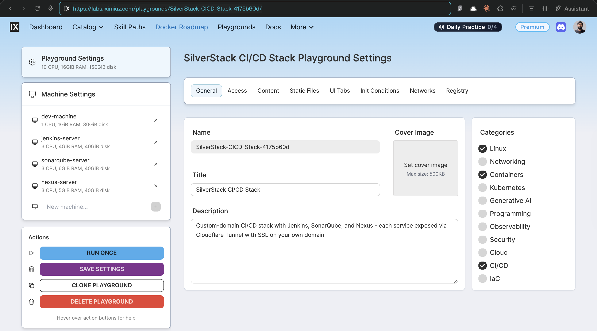

# SilverStack CI/CD Stack - Infrastructure & Orchestration

This runbook describes how I composed and provisioned my SilverStack CI/CD Stack on iximiuz Labs using a single manifest and four custom rootfs images.

It focuses on **infrastructure and topology** - what each node is, how images and manifests fit together, and how to access the stack via the Dev Machine.

Operational steps inside Jenkins, SonarQube, and Nexus (credentials, webhooks, repositories, etc.) are covered separately in [**Self‑Hosted CI/CD Stack - Operations**](cicd-stack-operations.md).



---

## Prerequisites

- iximiuz Labs account with `labctl` configured.
- Checkout the SilverStack repository containing rootfs images and manifests:
    - [`silver-stack`](https://github.com/ibtisam-iq/silver-stack)
- Four published rootfs images in GHCR:
    - `ghcr.io/ibtisam-iq/dev-cicd-rootfs:latest` - CI/CD Dev Machine rootfs.
    - `ghcr.io/ibtisam-iq/jenkins-rootfs:latest` - Jenkins server rootfs.
    - `ghcr.io/ibtisam-iq/sonarqube-rootfs:latest` - SonarQube server rootfs.
    - `ghcr.io/ibtisam-iq/nexus-rootfs:latest` - Nexus server rootfs.

---

## High‑Level Architecture

The stack is defined in a single iximiuz manifest
[`iximiuz/manifests/cicd-stack.yml`](https://github.com/ibtisam-iq/silver-stack/blob/main/iximiuz/manifests/cicd-stack.yml).

### Nodes and roles

All machines share a `local` network (`172.16.0.0/24`) and are created within one iximiuz playground.

- **Node 1 - `dev-machine`**
    - Drive: `oci://ghcr.io/ibtisam-iq/dev-cicd-rootfs:latest`, 30GiB disk.
    - Resources: 1 vCPU, 1GiB RAM.
    - Role: Jump host / DevOps workstation; primary IDE and terminal entry point into the stack.

- **Node 2 - `jenkins-server`**
    - Drive: `oci://ghcr.io/ibtisam-iq/jenkins-rootfs:latest`, 40GiB disk.
    - Resources: 3 vCPU, 4GiB RAM.
    - Role: CI/CD orchestrator using Jenkins LTS with Nginx reverse proxy and cloudflared prepared for custom domain.

- **Node 3 - `sonarqube-server`**
    - Drive: `oci://ghcr.io/ibtisam-iq/sonarqube-rootfs:latest`, 40GiB disk.
    - Resources: 3 vCPU, 6GiB RAM.
    - Role: SonarQube 26.2 CE with PostgreSQL 18 and Nginx, exposing `/health` plus HTTP UI.

- **Node 4 - `nexus-server`**
    - Drive: `oci://ghcr.io/ibtisam-iq/nexus-rootfs:latest`, 40GiB disk.
    - Resources: 3 vCPU, 5GiB RAM.
    - Role: Nexus 3.89.1‑02 CE with Nginx and cloudflared for artifact repositories (Maven, npm, Docker).

### Flexbox playground resource budget

The Flexbox playground type provides a shared resource pool of **10 vCPUs, 16 GiB RAM, and 150 GiB disk** across all machines in a single playground.

Each node's CPU, memory, and disk allocation is a deliberate sizing decision made to fit four machines within that pool while matching each service's actual runtime requirements:

- `dev-machine` receives the smallest slice (1 vCPU, 1 GiB RAM, 30 GiB) because it carries no server workloads - it is a jump host and terminal entry point only.
- `jenkins-server` gets 3 vCPUs and 4 GiB RAM to support build concurrency and the Jenkins plugin ecosystem.
- `sonarqube-server` gets the largest RAM allocation (6 GiB) because SonarQube runs an embedded Elasticsearch engine alongside PostgreSQL, both of which are memory-intensive.
- `nexus-server` gets 5 GiB RAM and the full 40 GiB disk to accommodate Maven, npm, and Docker artifact storage over time.

The disk sizes (30 GiB for the dev machine, 40 GiB for each service node) are set to stay within the 150 GiB total limit while leaving each service enough headroom for logs, artifacts, and data growth.


### Tabs and user experience

The manifest pre‑defines IDE and terminal tabs for each node plus HTTP tabs for service UIs:

- `IDE` + `dev` terminal on `dev-machine`.
- `jenkins`, `sonarqube`, and `nexus` terminals pointing to each service node.
- Three HTTP tabs bound to port 80: “Jenkins UI”, “SonarQube UI”, “Nexus UI”.

When the playground runs, you land on the Dev Machine terminal and see a **stack‑aware welcome banner** that explains the four nodes and how to SSH into each one.

---

## Dev CI/CD Machine Rootfs

The Dev Machine rootfs lives under
[`iximiuz/rootfs/dev/ci-cd`](https://github.com/ibtisam-iq/silver-stack/tree/main/iximiuz/rootfs/dev/ci-cd).

### Structure

```text
dev/ci-cd/
├── Dockerfile
├── welcome
└── scripts/
    └── customize-bashrc.sh
```

- Dockerfile - [`iximiuz/rootfs/dev/ci-cd/Dockerfile`](https://github.com/ibtisam-iq/silver-stack/blob/main/iximiuz/rootfs/dev/ci-cd/Dockerfile)
- Welcome banner - [`iximiuz/rootfs/dev/ci-cd/welcome`](https://github.com/ibtisam-iq/silver-stack/blob/main/iximiuz/rootfs/dev/ci-cd/welcome)
- `.bashrc` customization - [`scripts/customize-bashrc.sh`](https://github.com/ibtisam-iq/silver-stack/blob/main/iximiuz/rootfs/dev/ci-cd/scripts/customize-bashrc.sh)

### Dockerfile behavior

The Dockerfile is intentionally minimal and focuses on **UX, not services**:

- Base: `ghcr.io/ibtisam-iq/ubuntu-24-04-rootfs:latest` (systemd, SSH, curated tools).
- Accepts `USER`, `BUILD_DATE`, `VCS_REF` build args and sets OCI labels for created date and revision.
- Switches to `$USER`, sets `HOME=/home/$USER`.
- Copies `welcome` to `$HOME/.welcome` to display the CI/CD stack landing page on login.
- Uses a bind mount to run `scripts/customize-bashrc.sh`, appending stack‑specific aliases and navigation helpers to `.bashrc`.
- Exposes port 22 for SSH - no additional services are enabled on this node.

### Welcome banner

The banner explains the stack topology and directs users to service nodes:

- Describes the four nodes (Dev Machine, Jenkins, SonarQube, Nexus) and their roles.
- Emphasizes that this machine is the **entry point**; you SSH from here into each server and then follow the Cloudflare steps on each welcome page to bring domains live.
- Shows example SSH commands:

  ```text
  ssh jenkins-server      then follow steps → jenkins.yourdomain.com
  ssh sonarqube-server    then follow steps → sonar.yourdomain.com
  ssh nexus-server        then follow steps → nexus.yourdomain.com
  ```

- Lists key tools (arkade, jq, yq, fx, task, just, fzf, btop, cfssl, ripgrep, code‑server) inherited from the base rootfs.


### Bash aliases

`customize-bashrc.sh` appends convenient SSH aliases plus basic `ls` shortcuts:

```bash
alias stack-jenkins='ssh -o StrictHostKeyChecking=no ibtisam@jenkins-server'
alias stack-sonarqube='ssh -o StrictHostKeyChecking=no ibtisam@sonarqube-server'
alias stack-nexus='ssh -o StrictHostKeyChecking=no ibtisam@nexus-server'

alias ll='ls -alF'
alias la='ls -A'
alias l='ls -CF'
```

These aliases make it trivial to jump from the Dev Machine to each service node.

### Dev rootfs CI workflow

`ghcr.io/ibtisam-iq/dev-cicd-rootfs` is built and pushed by
[`.github/workflows/build-dev-cicd-rootfs.yml`](https://github.com/ibtisam-iq/silver-stack/blob/main/.github/workflows/build-dev-cicd-rootfs.yml).

- Triggers on changes under `iximiuz/rootfs/dev/ci-cd/**` (excluding `README.md`) and on edits to the workflow itself.
- Logs into GHCR and tags the image as `latest`, a `sha-<short-sha>` tag, and a date tag.
- Sets `USER=ibtisam` as a build argument so the Dev Machine user matches your primary account.

---

## Provisioning the Playground

### Step 1 - Create the CI/CD playground

From a machine where `labctl` is configured and the SilverStack repo is cloned, run:

```bash
labctl playground create --base flexbox cicd-stack \
  -f iximiuz/manifests/cicd-stack.yml
```

This command:

- Creates a playground titled **SilverStack CI/CD Stack**.
- Defines the `local` network (`172.16.0.0/24`).
- Boots all four machines with their respective rootfs images and resources.

### Step 2 - Verify tabs and connectivity

After the playground comes up:

1. Open the **IDE** and `dev` terminal tabs for `dev-machine` and confirm the welcome banner appears on login.
2. Use `stack-jenkins`, `stack-sonarqube`, and `stack-nexus` aliases (or raw `ssh` commands) to verify SSH connectivity from Dev Machine to each node.
3. Check that HTTP tabs “Jenkins UI”, “SonarQube UI”, and “Nexus UI” load the respective UIs on port 80 via Nginx (before Cloudflare; likely plain HTTP).

---

## Node Networking and Access Patterns

### Intra‑stack networking

- All four machines share the same `local` network, so they can reach each other by hostname (`jenkins-server`, `sonarqube-server`, `nexus-server`, `dev-machine`).
- Jenkins pipelines can talk to SonarQube and Nexus using their custom domains once Cloudflare is configured, or internally by hostnames for debugging.

### External access

Each service node’s rootfs image includes:

- Nginx configured as a reverse proxy on port 80.
- A `/health` endpoint for simple liveness checks.
- `cloudflared` installed and scripts/welcome instructions for creating Cloudflare Tunnels that expose `jenkins.yourdomain.com`, `sonar.yourdomain.com`, and `nexus.yourdomain.com` with SSL.

These Cloudflare steps are **per‑service** and are documented inside each node’s welcome banner and its dedicated rootfs runbook.

---

## Verification and Next Steps

### Minimal health checks

Before moving to application‑level configuration:

1. From Dev Machine, ensure each node’s core services are active (see their build runbooks for exact commands):
    - Jenkins: `systemctl is-active lab-init nginx jenkins` on `jenkins-server`.
    - SonarQube: `systemctl is-active lab-init postgresql nginx sonarqube` on `sonarqube-server`.
    - Nexus: `systemctl is-active lab-init nginx nexus` on `nexus-server`.
2. Confirm `/health` via `curl -f http://localhost/health` on each service node.

### Handover to operations runbook

Once all nodes are reachable and healthy, switch to
[**Self‑Hosted CI/CD Stack - Operations**](cicd-stack-operations.md) for:

- Jenkins post‑setup (pipeline tools, plugins).
- Credentials, SonarQube Scanner, Sonar server config.
- SonarQube webhooks.
- Nexus Maven `settings.xml` and Docker hosted repository configuration.

---

## Related Runbooks

- [**Rootfs - Ubuntu 24.04 base**](../../../containers/iximiuz/rootfs/setup-ubuntu-24-04-rootfs-base-image.md) - foundational image shared by all nodes.
- [**Rootfs - Jenkins Server**](../../../containers/iximiuz/rootfs/setup-jenkins-rootfs-image.md) - Jenkins LTS rootfs build and local testing.
- [**Rootfs - SonarQube Server**](../../../containers/iximiuz/rootfs/setup-sonarqube-rootfs.md) - SonarQube + PostgreSQL rootfs build and healthchecks.
- [**Rootfs - Nexus Server**](../../../containers/iximiuz/rootfs/setup-nexus-rootfs-image.md) - Nexus rootfs build and validation.
- [**Self‑Hosted CI/CD Stack - Operations**](cicd-stack-operations.md) - post‑provisioning configuration for Jenkins, SonarQube, and Nexus.
